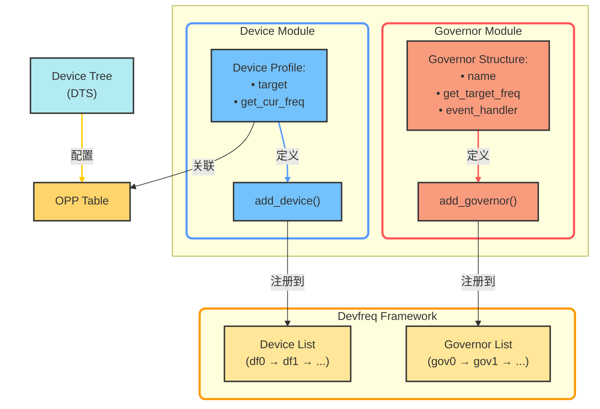
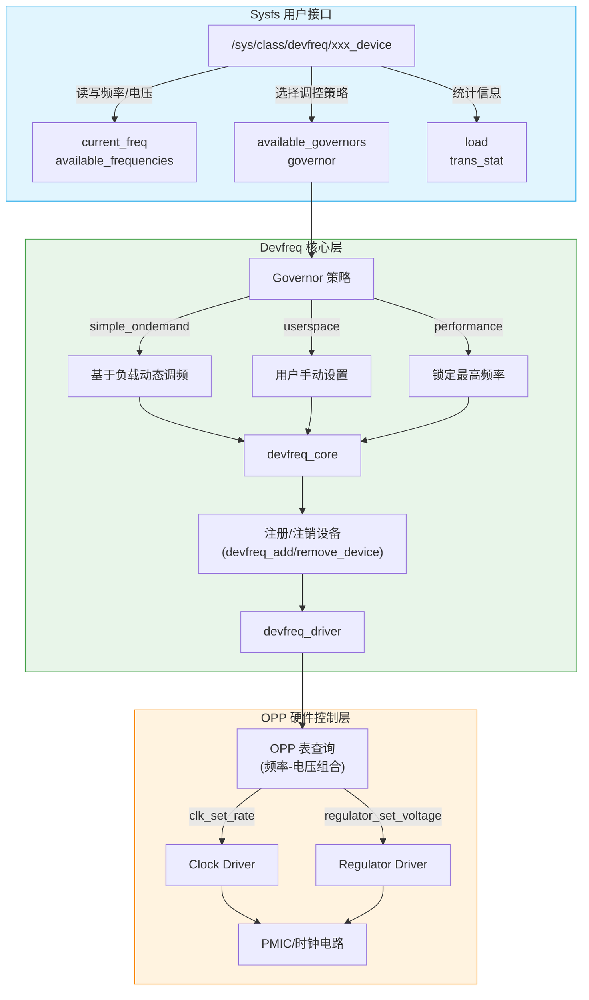
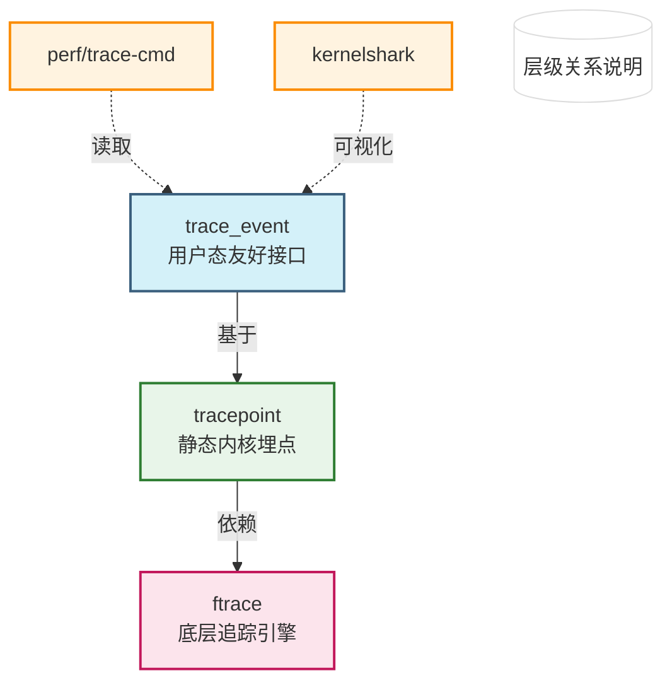

#   DDR学习笔记

## 电源管理

### 整体架构

https://www.wowotech.net/pm_subsystem/pm_architecture.html

http://events17.linuxfoundation.org/sites/events/files/slides/Intro_Kernel_PM.pdf

在保证系统运转的基础上，尽量节省对能量的消耗。

电源管理（Power Management）在Linux Kernel中，是一个比较庞大的子系统，涉及到供电（Power Supply）、充电（Charger）、时钟（Clock）、频率（Frequency）、电压（Voltage）、睡眠/唤醒（Suspend/Resume）等方方面面


这些组件（framework）是一个中间层的软件，提供软件开发的框架。

- 一是屏蔽具体的实现细节，固定对上的接口，这样可以方便上层软件的开发和维护；
- 二是尽可能抽象公共逻辑，并在Framework内实现，以提高重用性、减少开发量；
- 三是向下层提供一系列的回调函数（callback function），下层软件可能面对差别较大的现实，但只要填充这些回调函数，即可完成所有逻辑，减小了开发的难度。

> 组件介绍

- Power Supply，是一个供用户空间程序监控系统的供电状态（电池供电、USB供电、AC供电等等）的class。通俗的讲，它是一个Battery&Charger驱动的Framework
- **Clock Framework**，Clock驱动的Framework，用于统一管理系统的时钟资源
- Regulator Framework，Voltage/Current Regulator驱动的Framework。该驱动用于调节CPU等模块的电压和电流值
- Dynamic Tick/Clock Event，在传统的Linux Kernel中，系统Tick是**固定周期**（如10ms）的，因此**每隔一个Tick**，就会**产生一个Timer中断**。这会唤醒处于Idle或者Sleep状态的CPU，而**很多时候这种唤醒是没有意义**的。因此新的Kernel就提出了**Dynamic Tick**的概念，Tick不再是周期性的，而是根据系统中定时器的情况，不规律的产生，这样可以减少很多无用的Timer中断
- CPU Idle（空闲），用于控制CPU Idle状态的Framework
- **Generic PM**，传统意义上的Power Management，如Power Off、Suspend to RAM、Suspend to Disk、Hibernate等
- Runtime PM and Wakelock，运行时的Power Management，不再需要用户程序的干涉，由Kernel统一调度，实时的关闭或打开设备，以便在使用性能和省电性能之间找到最佳的平衡
  注3：Runtime PM是Linux Kernel亲生的运行时电源管理机制，Wakelock是由Android提出的机制。这两种机制的目的是一样的，因此只需要支持一种即可。另外，由于Wakelock机制路子太野了，饱受Linux社区的鄙视，因此我们不会对该机制进行太多的描述。
- **CPU Freq/Device Freq**，用于实现CPU以及Device频率调整的Framework
- **OPP**（Operating Performance Point，操作性能点），是指可以使SOCs或者Devices正常工作的电压和频率组合。内核提供这一个Layer，是为了在众多的电压和频率组合中，筛选出一些相对固定的组合，从而使事情变得更为简单一些
- **PM QOS**，所谓的PM QOS，是指系**统在指定的运行状态下（不同电压、频率，不同模式之间切换，等等）的工作质量**，包括latency（延迟）、timeout、throughput（吞吐量）三个参数，单位分别为us、us和kb/s。通过QOS参数，可以分析、改善系统的性能

### Generic PM

https://www.wowotech.net/pm_subsystem/generic_pm_architecture.html

指Linux系统中那些常规的电源管理手段，包括关机（Power off）、待机（Standby or Hibernate）、重启（Reboot）等。

这些手段是在嵌入式Linux普及之前的PC或者服务器时代使用的。在那个计算机科学的蛮荒时代，人类在摩尔定律的刺激下，孜孜追求的是计算机的计算能力、处理性能，因此并不特别关心Power消耗。

在这种背景下发展出来的Linux电源管理机制，都是粗放的、静态的、被动的。

Generic PM在传统的计算机操作系统中被广泛使用，因为那个时候对计算机的使用大多是**主动方式**。而对当前的移动互联来说，就非常不合时宜了，因为人们需要移动设备实时在线、**实时接收被动事件**（如来电），也就不可能主观地暂停使用（哪怕短短的一段时间）。这也就推动了Runtime PM的出现，

#### Generic PM的软件架构


根据上面的描述可知，Generic PM主要处理关机、重启、冬眠（Hibernate）、睡眠（Sleep，在Kernel中也称作Suspend）。在内核中，大致可以分为三个软件层次：

- API Layer，用于向用户空间提供接口，其中关机和重启的接口形式是系统调用（在新的内核中，关机接口还有一种新方式，具体讲到的时候再说），Hibernate和Suspend的接口形式是sysfs。
- PM Core，位于kernel/power/目录下，主要处理和硬件无关的核心逻辑。
- PM Driver，分为两个部分，一是**体系结构无关的Driver**，提供Driver框架（Framework）。另一部分是具体的**体系结构相关的Driver**，这也是电源管理驱动开发需要涉及到的内容（图中红色边框的模块）。

#### reboot过程


### PM接口

主要功能是：对下，定义Device PM相关的回调函数，让各个Driver实现；对上，实现统一的PM操作函数，供PM核心逻辑调用。

**对上统一调用，对下统一注册**

> device PM callbacks

通过 **统一的回调接口（PM callbacks）**，在 **恰当的时机**（如空闲、暂停、休眠）将设备 **同步切换至合理状态**（如关闭、低功耗、睡眠），以最小化系统功耗。

1. **旧版问题**：PM callbacks 直接散落在 `bus_type`、`device_driver` 等大型结构中，扩展性差，改动波及面广。
2. **新版方案**：通过 **`struct dev_pm_ops`** 统一封装所有回调，实现 **解耦**：
   - **抽象**：电源行为与设备模型分离，仅需包含此结构。
   - **扩展**：新增回调只需修改 `dev_pm_ops`，无需触碰上层结构。

**`从散落耦合到dev_pm_ops统一封装，内核电源管理实现优雅解耦`**

```c
struct dev_pm_ops {
	int (*prepare)(struct device *dev);
	void (*complete)(struct device *dev);
	int (*suspend)(struct device *dev);
	int (*resume)(struct device *dev);
	int (*freeze)(struct device *dev);
	int (*thaw)(struct device *dev);
	int (*poweroff)(struct device *dev);
	int (*restore)(struct device *dev);
	int (*suspend_late)(struct device *dev);
	int (*resume_early)(struct device *dev);
	int (*freeze_late)(struct device *dev);
	int (*thaw_early)(struct device *dev);
	int (*poweroff_late)(struct device *dev);
	int (*restore_early)(struct device *dev);
	int (*suspend_noirq)(struct device *dev);
	int (*resume_noirq)(struct device *dev);
	int (*freeze_noirq)(struct device *dev);
	int (*thaw_noirq)(struct device *dev);
	int (*poweroff_noirq)(struct device *dev);
	int (*restore_noirq)(struct device *dev);
	int (*runtime_suspend)(struct device *dev);
	int (*runtime_resume)(struct device *dev);
	int (*runtime_idle)(struct device *dev);
};
```

**PM Core**：在电源管理流程（如 suspend/resume）中，按 **明确的阶段顺序** 调用预定义的 callbacks（如 `prepare → suspend → suspend_late → suspend_noirq`）。

**`PM Core管流程，Driver管实现；回调是工具，场景才是老师`**

> device PM callbacks在设备模型中的体现

Linux设备模型中的很多数据结构，都会包含struct dev_pm_ops变量，比如bus_type、device_driver、class、device_type等结构中的pm指针。

> device PM callbacks的操作函数

内核在定义device PM callbacks数据结构的同时，为了方便使用该数据结构，也定义了大量的操作API，这些API分为两类。

- 通用的辅助性质的API，直接调用指定设备所绑定的driver的、pm指针的、相应的callback，如下

  ```c
     1: extern int pm_generic_prepare(struct device *dev);
     2: extern int pm_generic_suspend_late(struct device *dev);
     3: extern int pm_generic_suspend_noirq(struct device *dev);
     4: extern int pm_generic_suspend(struct device *dev);
     5: extern int pm_generic_resume_early(struct device *dev);
     6: extern int pm_generic_resume_noirq(struct device *dev);
     7: extern int pm_generic_resume(struct device *dev); 
     8: extern int pm_generic_freeze_noirq(struct device *dev);
     9: extern int pm_generic_freeze_late(struct device *dev);
    10: extern int pm_generic_freeze(struct device *dev);
    11: extern int pm_generic_thaw_noirq(struct device *dev);
    12: extern int pm_generic_thaw_early(struct device *dev);
    13: extern int pm_generic_thaw(struct device *dev);
    14: extern int pm_generic_restore_noirq(struct device *dev);
    15: extern int pm_generic_restore_early(struct device *dev);
    16: extern int pm_generic_restore(struct device *dev);
    17: extern int pm_generic_poweroff_noirq(struct device *dev);
    18: extern int pm_generic_poweroff_late(struct device *dev);
    19: extern int pm_generic_poweroff(struct device *dev); 
    20: extern void pm_generic_complete(struct device *dev);
  ```

  以pm_generic_prepare为例，就是查看dev->driver->pm->prepare接口是否存在，如果存在，直接调用并返回结果。

- 和整体电源管理行为相关的API，目的是将各个独立的电源管理行为组合起来，组成一个较为简单的功能，如下

  ```c
     1: #ifdef CONFIG_PM_SLEEP
     2: extern void device_pm_lock(void);
     3: extern void dpm_resume_start(pm_message_t state);
     4: extern void dpm_resume_end(pm_message_t state);
     5: extern void dpm_resume(pm_message_t state);
     6: extern void dpm_complete(pm_message_t state);
     7:  
     8: extern void device_pm_unlock(void);
     9: extern int dpm_suspend_end(pm_message_t state);
    10: extern int dpm_suspend_start(pm_message_t state);
    11: extern int dpm_suspend(pm_message_t state);
    12: extern int dpm_prepare(pm_message_t state);
    13:  
    14: extern void __suspend_report_result(const char *function, void *fn, int ret);
    15:  
    16: #define suspend_report_result(fn, ret)                                  \
    17:         do {                                                            \
    18:                 __suspend_report_result(__func__, fn, ret);             \
    19:         } while (0)
    20:  
    21: extern int device_pm_wait_for_dev(struct device *sub, struct device *dev);
    22: extern void dpm_for_each_dev(void *data, void (*fn)(struct device *, void *));
  ```

### Hibernate和Sleep功能

Hibernate和Sleep两个功能是Linux Generic PM的核心功能，它们的目的是类似的：暂停使用——>保存上下文——>关闭系统以节电········>恢复系统——>恢复上下文——>继续使用。

- **Hibernate**（冬眠）和**Sleep**（睡眠）

  是Linux电源管理在用户角度的抽象，是用户可以看到的实实在在的东西。它们的共同点，是保存系统运行的上下文后挂起（suspend）系统，并在系统恢复后接着运行，就像什么事情都没有发生一样。它们的不同点，是上下文保存的位置、系统恢复的触发方式以及具体的实现机制。

- **Suspend**

  有两个层次的含义。一是Hibernate和Sleep功能在底层实现上的统称，都是指挂起（Suspend）系统，根据上下文的保存位置，可以分为Suspend to Disk（STD，即Hibernate，上下文保存在硬盘/磁盘中）和Suspend to RAM（STR，为Sleep的一种，上下文保存在RAM中）；二是Sleep功能在代码级的实现，表现为“kernel/power/suspend.c”文件。

- **Standby**，是Sleep功能的一个特例，可以翻译为“**打盹**”。

  正常的Sleep（STR），会在处理完上下文后，由arch-dependent代码将CPU置为低功耗状态（通常为Sleep）。而现实中，根据对功耗和睡眠唤醒时间的不同需求，CPU可能会提供多种低功耗状态，如除Sleep之外，会提供Standby状态，该状态下，CPU处于浅睡眠模式，有任何的风吹草动，就会立即醒来。

- **Wakeup**

  睡眠时，为了缩短Wakeup时间，并不会关闭所有的供电，另外，为了较好的用户体验，通常会保留某些重要设备的供电（如键盘），那样**这些设备就可以唤醒系统**。这些刻意保留下来的、可以唤醒系统的设备，统称为**唤醒源**（Wakeup source）。而Wakeup source的选择，则是PM设计工作（特别是Sleep、Standby等功能）的重点。

> 软件架构


> 用户空间接口

- **/sys/power/state**

  state是sysfs中一个文件，为Generic PM的核心接口，在“kernel/power/main.c”中实现，用于将系统置于指定的Power State（供电模式，如Hibernate、Sleep、Standby等）。不同的电源管理功能，在底层的实现，就是在不同Power State之间切换。

  在内核中，有两种类型的Power State，一种是Hibernate相关的，名称为“disk”，除“disk”之外，内核在"kernel/power/suspend.c"中通过数组的形式定义了另外3个state，如下：

  ```c
  const char *const pm_states[PM_SUSPEND_MAX] = {
      [PM_SUSPEND_FREEZE]  = "freeze",
      [PM_SUSPEND_STANDBY] = "standby", 	// s1
      [PM_SUSPEND_MEM]     = "mem",		// s3
  };
  ```

  写入特定的Power State字符串，将会把系统置为该模式。

- **/sys/power/pm_trace**

  PM Trace用于提供电源管理过程中的Trace记录，由“CONFIG_PM_TRACE”宏定义（kernel/power/Kconfig）控制是否编译进内核，并由“/sys/power/pm_trace”文件在运行时控制是否使能该功能。

- **/sys/power/pm_test**

  PM test用于对电源管理功能的测试，由“CONFIG_PM_DEBUG”宏定义（kernel/power/Kconfig）控制是否编译进内核。其核心思想是：

  - 将电源管理过程按照先后顺序，划分为多个步骤，如core、platform、devices等。这些步骤称作PM Test Level。
  - 系统通过一个全局变量（pm_test_level），保存系统当前的PM Test Level。该变量的值可以通过”/sys/power/pm_test“文件获取及修改。
  - 在每一个电源管理步骤结束后，插入PM test代码，该代码以当前执行步骤为参数，会判断当前的PM Test Level和执行步骤是否一致，如果一致，则说明该步骤执行成功。出于Test考量，执行成功后，系统会打印Test信息，并在等待一段时间后，退出PM过程。
  - 开发人员可以通过修改全局的Test Level，有目的测试所关心的步骤是否执行成功。

- **/sys/power/wakeup_count**

  该接口只和Sleep功能有关，因此由“CONFIG_PM_SLEEP”宏定义（kernel/power/Kconfig）控制。它的存在，是为了解决Sleep和Wakeup之间的同步问题。唤醒系统就是唤醒CPU，而唤醒CPU的唯一途径，就是Wakeup source产生中断（内核称作Wakeup event）。

  - 系统处于sleep状态时，产生了Wakeup event。此时应该直接唤醒系统。这一点没有问题。
  - 系统在进入sleep的过程中，产生了Wakeup event。此时应该放弃进入sleep。

- **/sys/power/disk**

  该接口是STD特有的。用于设置或获取STD的类型。当前内核支持的STD类型包括：

  ```c
  static const char * const hibernation_modes[] = {
      [HIBERNATION_PLATFORM]  = "platform",
      [HIBERNATION_SHUTDOWN]  = "shutdown",
      [HIBERNATION_REBOOT]    = "reboot",
  #ifdef CONFIG_SUSPEND
      [HIBERNATION_SUSPEND]   = "suspend",
  #endif
  };
  ```

  - platform，表示使用平台特有的机制，处理STD操作，如使用hibernation_ops等。
  - shutdown，通过关闭系统实现STD，内核会调用kernel_power_off接口。
  - reboot，通过重启系统实现STD，内核会调用kernel_restart接口。
  - suspend，利用STR功能，实现STD。该类型下，STD和STR底层的处理逻辑类似。

- **/sys/power/image_size**

- **/sys/power/reserverd_size**

- **/sys/power/resume**

- **debugfs/suspend_status**

- **/dev/snapshot**

### Platform Driver framework

https://blog.csdn.net/tiantianhaoxinqing__/article/details/125889832

### PM QOS framework

http://www.wowotech.net/pm_subsystem/pm_qos_overview.html

https://zhuanlan.zhihu.com/p/561000691

PM QoS：Power Management Quality of Service，电源管理服务质量。在电源管理（PM）的**省电收益**与**性能损耗**之间建立动态平衡机制，通过**量化**各模块的**QoS需求**（延迟容忍度、吞吐量要求等），确保PM策略不会过度损害关键操作的性能。

1. **本质矛盾**
   - **省电** ↔ **性能** 是天然对立目标（如CPU降频降低功耗但增加计算延迟）。
   - QoS框架充当“调解员”，避免PM优化时“误伤”高优先级任务。
2. **框架角色**
   - **不测量QoS**，而是**响应需求**：
     驱动、进程等可声明自己的最低性能要求（如“USB传输期间CPU不得低于1GHz”），框架据此约束PM行为。
3. **设计哲学**
   - **需求驱动**：由**各模块主动提出**QoS约束，而非PM被动猜测。
   - **动态协商**：不同场景下自动调整PM策略（如视频播放时禁用睡眠，空闲时激进省电）。

> **`PM QoS是以需求驱动的性能-功耗平衡器，让省电不“越界”`**

#### 工作原理


- requestors提出对QoS的constraint。常见的requestor包括应用进程、GPU device、net device、flash device等等，它们基于自身的实际特性，需要系统的QoS满足一定的条件，才能正常工作。

- pm qos core负责汇整、整理这些constraint，并根据实际情况，计算出它们的极值（最大或者最小）。
- requestee在需要的时候，从pm qos core处获取constraint的极值，并确保自身的行为，可以满足这些constraints。一般情况下，requestee都是电源管理有关的service，包括[cpuidle](http://www.wowotech.net/tag/cpuidle)、[runtime pm](http://www.wowotech.net/tag/rpm)、[pm domain](http://www.wowotech.net/pm_subsystem/pm_domain_overview.html)等等。

实际上，Linux kernel使用“QoS dependencies”的概念，分别用“Dependents on a QoS value”和“Watchers of QoS value”表述这两个实体（可以理解为**QoS 值的依赖方**和**QoS 值的监视方**），具体可参考kernel/power/qos.c和drivers/base/power/qos.c的头文件。

> 约束分类

- **系统级约束**

  | **约束类型**  | **内核宏定义**              | **应用场景**             |
  | :------------ | :-------------------------- | :----------------------- |
  | CPU & DMA延迟 | `PM_QOS_CPU_DMA_LATENCY`    | 音视频同步、实时任务调度 |
  | 网络延迟      | `PM_QOS_NETWORK_LATENCY`    | 在线游戏、VoIP通话       |
  | 网络吞吐量    | `PM_QOS_NETWORK_THROUGHPUT` | 大文件下载、视频流传输   |
  | 内存带宽      | `PM_QOS_MEMORY_BANDWIDTH`   | GPU渲染、高性能计算      |

- **设备级约束**

  | **约束类型**   | **内核宏定义**             | **应用场景**                   |
  | :------------- | :------------------------- | :----------------------------- |
  | Resume延迟     | `PM_QOS_RESUME_LATENCY`    | 快速唤醒的SSD设备              |
  | Active状态延迟 | `PM_QOS_ACTIVE_LATENCY`    | 触摸屏响应延迟优化             |
  | QoS标志位      | `PM_QOS_FLAG_NO_POWER_OFF` | 关键外设（如安全芯片）禁止断电 |


- 需求方：各service、各driver。他们根据自己的功能需求，提出系统或某些功能的QOS约束，比如cpu&dma latency。

- 框架层：PM QOS framework，包含PM QOS classes、per device PM QOS。

  - 向需求方提供request的add、modify、remove等接口，用于管理QoS requests。对需求方的约束进行分类，计算出极值，比如cpu&dma latency不小于某个值。

  - 向执行方提供request value的查询接口。
  - PM QoS classes framework位于kernel/power/qos.c中，负责系统级别的PM QoS管理，通过misc设备（/dev/cpu_dma_latency），向用户空间程序提供PM QoS的request、modify、remove功能，以便满足各service对PM QoS的需求。
  - per-device PM QoS framework位于drivers/base/power/qos.c中，负责per-device的PM QoS管理。

- 执行方：power management的机制，比如cpuidle、cpu dvfs等。需要满足由框架层根据需求方提供的约束计算的极值，才能执行相应的低功耗机制。


#### 工作流程

> 初始化流程


> **PM QoS class framework的函数接口**

PM QoS class framework提供的API有两类：

- 以函数调用的形式，为kernel space的driver、service等提供的。

- 以misc设备的形式，为用户空间进程提供的。

  > **misc 设备（Miscellaneous Device）** 是一类特殊的字符设备，用于简化**非标准硬件**或**功能单一的外设**的驱动开发。
  >
  > 设计初衷是为那些**不足以单独分类**（如不属于块设备、网络设备等明确类别）、但又需要用户空间接口的设备提供统一的注册和管理机制
  >
  > 这种设计模式**将内核模块的功能抽象为设备节点**，用户进程通过文件I/O（如`open()`、`ioctl()`）与之交互，是一种典型的 **“内核-用户空间通信”** 方案。

1. **向kernel其它driver提供的，用于提出PM QoS需求的API**

   ```c
   void pm_qos_add_request(struct pm_qos_request *req, int pm_qos_class, s32 value);
   void pm_qos_update_request(structpm_qos_request *req, s32 new_value);
   void pm_qos_update_request_timeout(struct pm_qos_request *req, unsigned long timeout_us);
   void pm_qos_remove_request(struct pm_qos_request *req);
   int pm_qos_request_active(struct pm_qos_request *req);
   ```

   

2. **向kernel PM有关的模块提供的，用于获取、跟踪指定PM QoS需求的API**

   每当有新的QoS请求时，**framework会根据该QoS class的含义，计算出满足所有请求的一个极值**（如最大值、最小值等等）。该值可以通过pm_qos_request接口获得。例如cpuidle framework在选择C state时，会通过该接口获得系统对CPU&DMA latency的需求，并保证从C state返回时的延迟小于该value。

   另外，如果**某个实体在意某一个class的QoS value变化**，可以**通过pm_qos_add_notifier接口添加一个notifier**，这样当value变化时，framework便会通过notifier的回调函数，通知该实体。

   

3. **向per-device PM QoS framework提供，底层的PM QoS操作API**

   QoS class和per-device PM QoS都是基于底层的pm qos constraint封装而来的。对QoS class的使用者而言，可以不用关心这些底层细节。对per-device PM QoS framework而言，则需要利用它们实现自身的功能。

   ```c
   int pm_qos_update_target(struct pm_qos_constraints *c, struct plist_node *node, qos_req_action action, int value);
   
   bool pm_qos_update_flags(struct pm_qos_flags *pqf, qos_flags_request *req, qos_req_action action, s32 val);
   
   s32 pm_qos_read_value(struct pm_qos_constraints *c);
   ```

4. **向用户空间service提供的，用于提出QoS需求的API**

   /dev/cpu_dma_latency

   打开文件，将会使用默认值，向PM QoS framework添加一个QoS请求。

   关闭文件，会移除相应的请求。

   写入value，更改请求的值。

   读取文件，将会获取QoS的极值。

> **per-device PM QoS framework的函数接口**

针对指定设备的QoS framework

1. **向kernel其它driver提供的，用于提出per-device PM QoS需求的API**

   ```c
   int dev_pm_qos_add_request(struct device *dev, struct dev_pm_qos_request *req, enum dev_pm_qos_req_type type, s32 value);
   
   int dev_pm_qos_update_request(struct dev_pm_qos_request *req, s32 new_value);
   
   int dev_pm_qos_remove_request(struct dev_pm_qos_request *req);
   ```

   

2. **向kernel PM有关的模块（例如power domain）提供的，用于获取、跟踪指定PM QoS需求的API**

   ```c
   enum pm_qos_flags_status dev_pm_qos_flags(struct device *dev, s32 mask);
   
   s32 dev_pm_qos_read_value(struct device *dev);
   
   int dev_pm_qos_add_notifier(struct device *dev, struct notifier_block *notifier);
   
   int dev_pm_qos_remove_notifier(struct device *dev,struct notifier_block *notifier);
   ```

   

3. **向用户空间service提供的，用于提出per-device PM QoS需求的API**

   通过sysfs文件，kernel允许用户空间程序对某个设备提出QoS需求，这些sysfs文件位于各个设备的sysf目录下，默认情况下，PM QoS framework不会创建这些文件，需要具体设备驱动调用dev_pm_qos_expose_*系列接口，主动创建。

### Platform QOS

`platform_qos` 是 Linux 内核中针对 **Platform 设备**的 **服务质量（Quality of Service, QoS）** 扩展机制，它结合了 Platform Bus 的设备管理能力和 PM QoS 的性能/功耗约束功能，专门用于管理片上系统（SoC）中 Platform 设备的资源分配和性能保障。

`platform_qos` 是 Platform 设备专用的 **精细化性能管理工具**，它：

- 继承 PM QoS 的核心思想，但针对 Platform 设备特性优化
- 通过设备树或 sysfs 灵活配置
- 与 `devfreq`、`cpufreq` 等联动实现端到端的服务质量保障
- 尤其适合对实时性、带宽敏感的嵌入式场景

#### 数据结构

```c
struct platform_qos_request {}
struct platform_qos_flags_request {}
enum platform_qos_type {}
enum {//里面定义一些自己需要的服务质量，比如内存延迟、内存吞吐、L1总线延迟等}
struct platform_qos_constraints {}
struct platform_qos_flags {}
enum platform_qos_req_action {}
struct platform_qos_req_data {}
```


#### 函数接口

```c
int platform_qos_request(int platform_qos_class);
int platform_qos_request_active(struct platform_qos_request *req);
s32 platform_qos_read_value(struct platform_qos_constraints *c);
void platform_qos_add_request(struct platform_qos_request *req,
			      int platform_qos_class, s32 value);
void platform_qos_update_request(struct platform_qos_request *req,
				 s32 new_value);
void platform_qos_update_request_timeout(struct platform_qos_request *req,
					 s32 new_value,
					 unsigned long timeout_us);
void platform_qos_remove_request(struct platform_qos_request *req);

int platform_qos_add_notifier(int platform_qos_class, struct notifier_block *notifier);
int platform_qos_remove_notifier(int platform_qos_class, struct notifier_block *notifier);
int platform_qos_debug_record(int platform_qos_class,
		int *active_nums, struct platform_qos_req_data *data, int data_size);
```

| **函数原型**                              | **参数说明**                                                 | **返回值**        | **功能描述**                        | **使用场景**                               |
| :---------------------------------------- | :----------------------------------------------------------- | :---------------- | :---------------------------------- | :----------------------------------------- |
| **`platform_qos_request`**                | `platform_qos_class`: QoS 类型（如延迟、带宽）               | 当前约束值        | 查询指定 QoS 类型的当前有效值       | 快速检查当前系统约束状态                   |
| **`platform_qos_request_active`**         | `req`: 要检查的 QoS 请求指针                                 | 1=活跃 / 0=未激活 | 检查请求是否已注册并生效            | 调试或条件操作前验证请求状态               |
| **`platform_qos_read_value`**             | `c`: QoS 约束结构体指针                                      | 当前目标值        | 直接读取约束结构体的 `target_value` | 底层约束管理逻辑                           |
| **`platform_qos_add_request`**            | `req`: 请求对象 `platform_qos_class`: QoS 类型 `value`: 初始约束值 | 无                | 注册一个新的 QoS 请求               | 驱动初始化时设置初始约束                   |
| **`platform_qos_update_request`**         | `req`: 已注册的请求 `new_value`: 新约束值                    | 无                | 更新现有请求的约束值                | 动态调整性能需求（如温度变化时降频）       |
| **`platform_qos_update_request_timeout`** | `req`: 请求对象 `new_value`: 临时约束值 `timeout_us`: 超时时间（微秒） | 无                | 临时更新约束值，超时后恢复原值      | 保障短时高负载任务（如相机拍照）           |
| **`platform_qos_remove_request`**         | `req`: 要移除的请求                                          | 无                | 注销 QoS 请求并释放资源             | 驱动卸载或约束不再需要时                   |
| **`platform_qos_add_notifier`**           | `platform_qos_class`: QoS 类型 `notifier`: 通知块指针        | 0=成功 / 错误码   | 注册约束变化通知回调                | 需要实时响应约束变化的模块（如 DVFS 驱动） |
| **`platform_qos_remove_notifier`**        | `platform_qos_class`: QoS 类型 `notifier`: 已注册的通知块    | 0=成功 / 错误码   | 移除通知回调                        | 模块卸载时清理资源                         |
| **` platform_qos_debug_record`**          | `platform_qos_class`: QoS 类型 `active_nums`: 返回活跃请求数 `data`: 请求数据数组 `data_size`: 数组容量 | 实际填充的数据量  | 调试接口，获取当前所有活跃请求详情  | 系统调试或日志分析                         |

### devfreq framework

当今的复杂SoC由多个子模块协同工作组成（CPU，NPU，GPU等）。

**在执行各种用例的操作系统中，并非SoC中的所有模块都需要始终保持最高性能**。

为方便起见，将SoC中的子模块分组为域，从而允许某些域以较低的电压和频率运行，而其他域以较高的电压/频率对运行。

对于**这些设备支持的频率和电压对**，我们称之为**OPP**（Operating Performance Point）。

对于具有OPP功能的**非CPU设备**，本文称之为OPP device，需要通过devfreq进行动态的调频调压。

- cpufreq驱动并不允许多个设备来注册，而且也不适合不同的设备具有不同的governor。
- devfreq则支持多个设备，并且允许每个设备有自己对应的governor。






#### 工作流程

1. **初始化**：设备驱动创建 devfreq 实例，设置 profile 和初始 governor
2. **监控**：通过工作队列定期调用 governor 的 get_target_freq
3. **决策**：Governor 根据设备状态(last_status)计算目标频率
4. **限制检查**：考虑 scaling_min/max_freq 和 PM QoS 限制
5. **频率切换**：通过 profile->target 实际设置设备频率
6. **通知**：通过 notifier_list 通知相关组件频率变化

#### 核心数据结构

##### 1. **`devfreq_dev_profile` 结构体**

```c
struct devfreq_dev_profile {
    unsigned long initial_freq;
    unsigned int polling_ms;
    enum devfreq_timer timer;
    int (*target)(struct device *dev, unsigned long *freq, u32 flags);
    int (*get_dev_status)(struct device *dev,
                  struct devfreq_dev_status *stat);
    int (*get_cur_freq)(struct device *dev, unsigned long *freq);
    void (*exit)(struct device *dev);
    void (*update_polling_ms)(struct devfreq *df);
    unsigned long *freq_table;
    unsigned int max_state;
};
```

| 成员           | 类型                 | 说明                           |
| :------------- | :------------------- | :----------------------------- |
| `initial_freq` | `unsigned long`      | 设备启动时的初始频率值         |
| `polling_ms`   | `unsigned int`       | 状态轮询间隔（毫秒）           |
| `timer`        | `enum devfreq_timer` | 使用的定时器类型枚举           |
| `freq_table`   | `unsigned long *`    | 可选频率表（支持的频率列表）   |
| `max_state`    | `unsigned int`       | 频率表的最大状态数（频率项数） |

| 回调函数           | 参数                                                         | 功能             | 返回值               |
| :----------------- | :----------------------------------------------------------- | :--------------- | :------------------- |
| `target()`         | `dev`: 目标设备 `freq`: 输入期望频率/输出实际频率 `flags`: 标志位 | 设置目标频率     | `0`=成功 `负值`=错误 |
| `get_dev_status()` | `dev`: 目标设备 `stat`: 输出设备状态                         | 获取当前设备状态 | `0`=成功 `负值`=错误 |
| `get_cur_freq()`   | `dev`: 目标设备 `freq`: 输出当前频率                         | 获取当前实际频率 | `0`=成功 `负值`=错误 |

##### 2. `struct devfreq_governor`结构体

```c
struct devfreq_governor {
    struct list_head node;
    const char name[DEVFREQ_NAME_LEN];
    const unsigned int immutable;
    const unsigned int interrupt_driven;
    int (*get_target_freq)(struct devfreq *this, unsigned long *freq);
    int (*event_handler)(struct devfreq *devfreq,
                unsigned int event, void *data);
};
```

| 成员                   | 类型                                              | 说明                                   | 是否必须赋值 |
| :--------------------- | :------------------------------------------------ | :------------------------------------- | :----------- |
| **`node`**             | `struct list_head`                                | 内核链表节点（由内核自动管理）         | ❌ 否         |
| **`name`**             | `const char[DEVFREQ_NAME_LEN]`                    | 调控策略的唯一标识名称                 | ✔️ 是         |
| **`immutable`**        | `const unsigned int`                              | 标志位：策略是否不可修改               | ✔️ 是         |
| **`interrupt_driven`** | `const unsigned int`                              | 标志位：是否由中断驱动（非定时器轮询） | ❌ 可选       |
| **`get_target_freq`**  | `int (*)(struct devfreq *, unsigned long *)`      | 核心回调：计算目标频率                 | ✔️ 是         |
| **`event_handler`**    | `int (*)(struct devfreq *, unsigned int, void *)` | 事件处理回调：响应系统事件             |              |

> `event_handler`

| 事件                          | 值   | 触发场景     |
| :---------------------------- | :--- | :----------- |
| `DEVFREQ_GOV_START`           | 1    | 调控器启动   |
| `DEVFREQ_GOV_STOP`            | 2    | 调控器停止   |
| `DEVFREQ_GOV_UPDATE_INTERVAL` | 3    | 更新轮询间隔 |
| `DEVFREQ_GOV_SUSPEND`         | 4    | 设备挂起     |
| `DEVFREQ_GOV_RESUME`          | 5    | 设备恢复     |

##### 3. `struct devfreq`结构体

```c
struct devfreq {
    struct list_head node;
    struct mutex lock;
    struct device dev;
    struct devfreq_dev_profile *profile;
    const struct devfreq_governor *governor;
    char governor_name[DEVFREQ_NAME_LEN];
    struct notifier_block nb;
    struct delayed_work work;
    unsigned long previous_freq;
    struct devfreq_dev_status last_status;
    void *data;
    struct dev_pm_qos_request user_min_freq_req;
    struct dev_pm_qos_request user_max_freq_req;
    unsigned long scaling_min_freq;
    unsigned long scaling_max_freq;
    bool stop_polling;
    unsigned long suspend_freq;
    unsigned long resume_freq;
    atomic_t suspend_count;
    struct devfreq_stats stats;
    struct srcu_notifier_head transition_notifier_list;
    struct notifier_block nb_min;
    struct notifier_block nb_max;
};
```

| 成员名                     | 注释说明                                                     |
| -------------------------- | ------------------------------------------------------------ |
| `node`                     | 用于将 `devfreq` 实例链接到全局 `devfreq` 列表，实现链表管理 |
| `lock`                     | 保护 `devfreq` 结构的互斥锁，保障多线程 / 多进程访问时数据一致性 |
| `dev`                      | 关联的设备结构，用于关联具体硬件设备对象                     |
| `profile`                  | 指向设备特定频率调节配置的指针，描述设备频率调节相关的参数、策略等 |
| `governor`                 | 当前使用的频率调节策略（`governor`），决定设备频率动态调节的逻辑 |
| `governor_name`            | 频率调节策略（`governor`）的名称，以字符串形式存储           |
| `nb`                       | 用于接收系统通知的 `notifier block`，可响应系统层面的事件通知 |
| `work`                     | 延迟工作队列，用于定时执行频率调节相关任务，实现异步、延时的频率调整逻辑 |
| `previous_freq`            | 设备上一次设置的频率，记录历史频率状态                       |
| `last_status`              | 设备上一次的状态信息，保存设备状态相关数据（如负载、性能等） |
| `data`                     | 频率调节策略（`governor`）的私有数据指针，供策略内部自定义数据使用 |
| `user_min_freq_req`        | PM QoS 最小频率请求，用于管理用户侧对设备最低运行频率的需求  |
| `user_max_freq_req`        | PM QoS 最大频率请求，用于管理用户侧对设备最高运行频率的需求  |
| `scaling_min_freq`         | 当前允许的最小频率，设备实际运行频率的下限约束               |
| `scaling_max_freq`         | 当前允许的最大频率，设备实际运行频率的上限约束               |
| `stop_polling`             | 是否停止轮询的标志，控制频率调节相关轮询操作的启停           |
| `suspend_freq`             | 挂起时使用的频率，设备进入挂起状态前设置的频率值             |
| `resume_freq`              | 恢复时使用的频率，设备从挂起状态恢复后初始使用的频率值       |
| `suspend_count`            | 挂起计数，统计设备进入挂起状态的次数等情况                   |
| `stats`                    | 设备频率转换统计信息，记录频率切换次数、耗时等统计数据       |
| `transition_notifier_list` | 频率转换通知链，用于在设备频率转换时，向注册的通知者发送事件通知 |
| `nb_min`                   | 最小频率变化的通知块，响应设备最小允许频率发生改变的事件     |
| `nb_max`                   | 最大频率变化的通知块，响应设备最大允许频率发生改变的事件     |

#### 核心函数接口

##### 1. governor相关

```c
int devfreq_add_governor(struct devfreq_governor *governor);
int devfreq_remove_governor(struct devfreq_governor *governor);
int devfreq_update_status(struct devfreq *devfreq, unsigned long freq);
int update_devfreq(struct devfreq *devfreq);

extern void devfreq_monitor_start(struct devfreq *devfreq);
extern void devfreq_monitor_stop(struct devfreq *devfreq);
extern void devfreq_monitor_suspend(struct devfreq *devfreq);
extern void devfreq_monitor_resume(struct devfreq *devfreq);
```

| **函数原型**                  | **参数**                               | **返回值**                                              | **功能描述**                            |
| :---------------------------- | :------------------------------------- | :------------------------------------------------------ | :-------------------------------------- |
| **`devfreq_add_governor`**    | `governor`: 指向要注册的调控策略结构体 | `0`: 成功 `-EEXIST`: 同名策略已存在 `-EINVAL`: 无效参数 | 向 devfreq 框架注册一个新的频率调控策略 |
| **`update_devfreq;`**         | `devfreq`: 目标设备实例                | `0`: 成功 `负值`: 错误代码                              | 立即触发一次频率更新（绕过定时器）      |
| **`devfreq_monitor_start`**   | `devfreq`: 目标设备实例                | 无                                                      | 启动设备的监控定时器                    |
| **`devfreq_monitor_stop`**    | `devfreq`: 目标设备实例                | 无                                                      | 停止设备的监控定时器                    |
| **`devfreq_monitor_suspend`** | `devfreq`: 目标设备实例                | 无                                                      | 暂停监控（保持状态）                    |
| **`devfreq_monitor_resume`**  | `devfreq`: 目标设备实例                | 无                                                      | 恢复暂停的监控                          |

##### 2. devfreq相关


#### 参考文献

1. [Linux devfreq framework 剖析 - 内核工匠 - 博客园 (cnblogs.com)](https://www.cnblogs.com/Linux-tech/p/12961282.html)
2. https://blog.csdn.net/qq_45698138/article/details/141964232?spm=1001.2101.3001.6650.13&utm_medium=distribute.pc_relevant.none-task-blog-2%7Edefault%7EBlogCommendFromBaidu%7ERate-13-141964232-blog-104260671.235%5Ev43%5Epc_blog_bottom_relevance_base5&depth_1-utm_source=distribute.pc_relevant.none-task-blog-2%7Edefault%7EBlogCommendFromBaidu%7ERate-13-141964232-blog-104260671.235%5Ev43%5Epc_blog_bottom_relevance_base5&utm_relevant_index=16 devfreq 内核框架介绍

### 补充点

#### ACPI

ACPI（Advanced Configuration and Power Interface，高级配置与电源接口）是一套由 Intel、Microsoft 和 Toshiba 共同制定的**硬件电源管理与配置规范**，现已成为现代计算机（x86/ARM 等架构）电源管理的核心标准。

> **ACPI 的核心目标**

- **统一硬件抽象**：提供操作系统与硬件固件（BIOS/UEFI）之间的标准化接口，取代传统的 BIOS 电源管理方式。
- **动态电源管理**：支持系统状态的智能切换（如睡眠、休眠、性能调节）。
- **设备配置**：通过结构化表（ACPI Tables）描述硬件拓扑，替代传统的 PnP（即插即用）机制。

> **ACPI 的关键组件**

**(1) ACPI 表（ACPI Tables）**

- **DSDT（Differentiated System Description Table）**：核心硬件描述表，包含设备信息和电源控制方法（AML 代码）。
- **FADT（Fixed ACPI Description Table）**：定义固定寄存器（如电源按钮、睡眠控制）。
- **SSDT（Secondary System Description Table）**：补充设备描述，支持模块化扩展。
- **MADT（Multiple APIC Description Table）**：多处理器配置信息（如 CPU 核心、中断控制器）。

**(2) ACPI 状态（Power States）**

- **全局状态（Gx）**：
  - **G0（Working）**：正常运行。
  - **G1（Sleeping）**：细分睡眠子状态（S0ix, S1-S4）。
  - **G2（Soft Off）**：完全关机（保留少量供电，如 USB 唤醒）。
  - **G3（Mechanical Off）**：彻底断电。
- **设备状态（Dx）**：
  - **D0（Full On）** 到 **D3（Off）**，表示设备功耗级别。

**(3) ACPI 方法（Control Methods）**

- 用 **AML（ACPI Machine Language）** 编写的逻辑，由操作系统在运行时解释执行。例如：
  - `_PS0`：打开设备电源。
  - `_PRW`：定义设备唤醒能力。

#### SOC电源域和时钟域的划分

现代手机SoC（如高通骁龙、联发科天玑、苹果A系列）通常采用**多层级的域划分策略**，以实现动态电压频率调整（DVFS）、电源门控（Power Gating）和时钟门控（Clock Gating）等节能技术。

> 手机SoC通常划分为以下几个关键域：

1. **Always-On（常开域）**
   - **功能**：负责系统的基础运行，即使手机处于休眠状态（如锁屏）仍需工作。
   - **包含模块**：电源管理单元（PMIC接口）、实时时钟（RPC, RTC）、唤醒控制器（Wake-up Controller）、部分传感器（如加速度计、光线传感器）
   - **供电特点**：极低电压（0.6V~0.8V）、超低频率（32kHz~几MHz）、通常不支持完全断电（否则无法响应按键/传感器唤醒）
2. **应用处理器（AP Domain）**
   - **功能**：运行操作系统（Android/iOS）和用户应用，是SoC的核心计算部分。
   - **典型子域划分**：
     - **大核（Performance CPU Cluster）**
       - 如Cortex-X系列（ARM）或Firestorm（苹果）
       - 高电压（0.9V~1.2V），高频（3GHz+）
     - **小核（Efficiency CPU Cluster）**
       - 如Cortex-A5xx/A7xx（ARM）或Icestorm（苹果）
       - 低电压（0.7V~0.9V），低频（1GHz~2GHz）
     - **共享缓存（LLC, Last-Level Cache）**
       - 可能独立供电以支持动态调整
3. **GPU域（Graphics Domain）**
   - **功能**：处理图形渲染、游戏、UI动画等任务。
   - **供电特点**：支持DVFS（动态调频调压）、典型电压范围：0.8V~1.1V、频率范围：300MHz~1GHz+（如Adreno GPU）
   - **优化策略**：低负载时降频（如浏览网页）、高负载时升压（如游戏）
4. **神经网络处理单元（NPU/AI Domain）**
   - **功能**：加速AI计算（如人脸识别、语音助手、相机HDR）。
   - **供电特点**：通常独立供电，支持突发高性能计算；电压范围：0.8V~1.0V；可动态开关（部分任务完成后断电）
5. **影像处理单元（ISP Domain）**
   - **功能**：处理摄像头数据（如多帧合成、降噪、HDR）。
   - **供电特点**：
     - 按需供电（拍照/录像时激活）
     - 电压通常0.9V~1.0V
     - 可能进一步划分：
       - **前端ISP**（低功耗，负责基础处理）
       - **后端ISP**（高性能，负责AI增强）
6. **基带处理器（Modem Domain）**
   - **功能**：负责蜂窝通信（5G/4G/Wi-Fi/蓝牙）。
   - **供电特点**：
     - 分多个子域：
       - **RF前端**（高电压，高频）
       - **基带DSP**（中等功耗）
       - **待机模块**（低功耗，监听网络信号）
     - 5G Modem通常比4G更耗电，需精细调控
7. **内存控制器（Memory Domain）**
   - **功能**：管理DRAM（LPDDR5/LPDDR5X）访问。
   - **供电特点**：
     - 电压较高（1.05V~1.2V）
     - 支持动态调整（如DDR频率从800MHz升至3.2GHz）
8. **外设域（Peripheral Domain）**
   - **功能**：管理USB、显示屏、存储（UFS）、音频等。
   - **供电特点**：
     - 部分外设可完全断电（如NFC不用时关闭）
     - 部分需低功耗运行（如蓝牙LE）

#### SOC架构

| **子模块**                | **功能**                 | **协同工作场景**                    | **电源/时钟管理**                |
| :------------------------ | :----------------------- | :---------------------------------- | :------------------------------- |
| **CPU集群**               | 应用运算（大核+小核）    | 游戏时大核满频，小核处理后台任务    | DVFS动态调压（0.7V~1.2V）        |
| **GPU**                   | 图形渲染                 | 游戏/AR时与CPU共享渲染负载          | 独立电压域，按帧率调整频率       |
| **NPU**                   | AI加速（图像识别、语音） | 拍照时与ISP协同进行场景识别         | 突发式供电，任务完成后断电       |
| **ISP**                   | 图像信号处理             | 多摄像头数据合成HDR照片             | 拍照时激活，待机时关闭           |
| **5G Modem**              | 蜂窝通信                 | 下载数据时与内存控制器交互          | 分时供电（RF前端高功耗按需启动） |
| **DDR内存控制器**         | 管理LPDDR5X内存访问      | 为CPU/GPU提供低延迟数据             | 随CPU频率动态调整带宽            |
| **显示引擎**              | 驱动屏幕（120Hz LTPO）   | 根据内容动态调整刷新率（1Hz~120Hz） | 与GPU共享部分计算资源            |
| **存储控制器（UFS 4.0）** | 高速存储读写             | 应用加载时与CPU直接通信（DMA）      | 空闲时进入低功耗模式             |
| **电源管理IC（PMIC）**    | 多电压轨调节             | 实时监控各域功耗并调整供电策略      | 全局协调，支持快速唤醒           |

> **协同工作的关键技术**

**(1) 跨域通信**

- **片上网络（NoC）**：
  类似“数据高速公路”，优先级调度CPU/GPU/NPU间的通信（如ARM AMBA ACE协议）。
- **共享缓存一致性**：
  CPU/GPU/NPU通过**一致性总线（如CCIX）**共享数据，避免重复搬运。

**(2) 功耗与性能平衡**

- **异构调度器**：
  安卓/Linux内核的**EAS调度器**动态分配任务给大核/小核/NPU。
- **温度反馈控制**：
  传感器实时监测热点，触发**动态热管理（DTP）**降频或关闭模块。

**(3) 实时性保障**

- **中断优先级**：
  触摸屏/Modem数据等低延迟请求通过**快速中断（FIQs）**抢占CPU资源。
- **硬件加速器直连**：
  如摄像头数据通过**专用DMA通道**直达ISP，不经过CPU。

## ftrace、tracepoint、trace_event机制

https://www.cnblogs.com/wsg1100/p/17020703.html




## 知识点补充

### 1.DDR负载

DDR负载衡量的是内存控制器和内存颗粒在单位时间内处理数据请求的繁忙程度，主要包括：

- **带宽占用率**：实际数据传输量占理论最大带宽的比例。
- **访问频率**：读写操作的密集程度（如每秒操作次数）。
- **队列深度**：等待处理的内存请求数量。

> **关键指标与测量方式**

1. **带宽利用率（Bandwidth Utilization）**

   - **公式**：
     $$
     利用率=\frac{实际传输数据量 (GB/s)}{理论带宽 (GB/s)}×100%
     $$

     - **理论带宽计算**：
       DDR4-3200（单通道）：3200MT/s×64bit/8≈25.6GB/s3200MT/s×64bit/8≈25.6GB/s
       （双通道翻倍为51.2 GB/s）

   - **工具**：

     - Linux: `sar -r`, `perf stat`, `vtune`
     - Windows: Task Manager（内存性能选项卡）、AIDA64。

2. **读写比例（Read/Write Ratio）**

   - 负载特性取决于读写操作占比：
     - **读密集型**（如数据库查询） vs **写密集型**（如视频渲染）。
   - 通过内存性能工具（如`perf mem`）统计读写操作次数。

3. **延迟（Latency）**

   - **高负载表现**：访问延迟增加（因队列竞争或Bank冲突）。
   - **测量工具**：
     - `lmbench`（内存延迟测试）
     - Intel MLC（Memory Latency Checker）。

4. **占用率（Occupancy）**

   - **内存控制器占用率**：处理指令队列的时间占比（如通过PMU性能计数器获取）。
   - **Bank-Level并行度**：DDR内存的Bank冲突会降低效率。

### 2.pm_qos

**PM_QoS**（Power Management Quality of Service，电源管理服务质量）是 **Linux 内核** 中的一个机制，用于**协调不同组件对系统电源管理（如 CPU 频率、设备低功耗状态）的需求**，确保系统在满足性能要求的同时尽可能节省功耗。

> **1. PM_QoS 的作用**

在 Linux 系统中，多个进程或设备可能对电源管理有不同的需求：

- **性能优先**（如游戏、视频播放）希望 CPU 保持高频运行。
- **节能优先**（如后台服务）希望 CPU 进入低功耗状态。

PM_QoS 的作用是：

- **收集** 不同组件（CPU、GPU、设备驱动等）的电源管理需求（QoS 请求）。
- **仲裁** 这些需求，决定最终的电源管理策略（如 CPU 频率、设备是否进入休眠）。
- **通知** 相关子系统（如 CPUFreq、DevFreq）调整电源状态。

> **2. PM_QoS 的主要应用场景**

**(1) CPU 频率管理（CPUFreq）**

- 某些任务（如音视频播放）要求 CPU 保持最低频率（`min_freq`），避免卡顿。
- PM_QoS 可以设置 `cpu_dma_latency` 或 `min_frequency` 约束，防止 CPU 降频过低。

**(2) 设备电源管理（Runtime PM）**

- 某些外设（如网卡、SSD）在数据传输时不能被挂起（suspend）。
- PM_QoS 可以设置 `DEVICE_PM_QOS_RESUME_LATENCY`（恢复延迟约束），确保设备能快速唤醒。

**(3) 实时性要求（如音频）**

- 音频播放需要低延迟，避免 CPU 进入深度休眠（如 `C-states`）。
- PM_QoS 可以设置 `latency_tolerance`，限制 CPU 进入高延迟省电模式。

| 特性            | 说明                                                   |
| :-------------- | :----------------------------------------------------- |
| **PM_QoS 作用** | 协调不同组件对电源管理的需求（性能 vs 功耗）           |
| **典型应用**    | CPU 频率管理、设备电源管理、低延迟任务                 |
| **用户接口**    | `/sys/devices/virtual/power/pm_qos/`                   |
| **内核 API**    | `pm_qos_add_request()`, `pm_qos_update_request()`      |
| **常见约束**    | `cpu_dma_latency`, `resume_latency`, `network_latency` |

### 3.platform

Platform 机制是 Linux 内核中用于管理 **嵌入式/SOC（系统级芯片）硬件平台** 的核心框架，它提供了一种标准化的方式来描述和操作与平台相关的硬件设备（如时钟控制器、中断控制器、GPIO、DMA 等非外设类硬件资源）。

平台设备模型是对device和driver模型的扩展。

> 解决什么问题？

在嵌入式系统中，许多硬件设备是直接集成在 SOC 内部的（例如 UART、I2C 控制器、电源管理单元等），它们：

- **不是标准外设**（如 USB、PCIe 设备），无法通过总线枚举（Bus Scanning）自动发现。
- **依赖 SOC 特定配置**（如寄存器地址、中断号）。

Platform 机制通过 **设备-驱动匹配模型** 和 **硬件资源抽象**，统一管理这些设备。

> 核心功能

1. **设备抽象**
   将 SOC 内置硬件抽象为 `platform_device`。
2. **驱动匹配**
   通过 `platform_driver` 绑定设备与驱动。
3. **资源管理**
   统一处理内存映射、中断、DMA 通道等资源。
4. **电源管理**
   支持 `suspend/resume` 等低功耗操作。

> 关键数据结构

1. **platform_device（平台设备）**

   描述一个具体的硬件设备，通常在 **设备树（Device Tree）** 或 **ACPI** 中定义，内核启动时注册：

   ```c
   struct platform_device {
       const char *name;       // 设备名称（匹配驱动的关键）
       int id;                 // 实例ID（同名设备区分用）
       struct device dev;      // 基础设备结构
       struct resource *resource; // 硬件资源数组
       unsigned int num_resources; // 资源数量
       // ...
   };
   ```

   **`resource`** 描述设备的硬件资源，例如：

   ```c
   struct resource {
       resource_size_t start; // 起始地址（物理地址或IRQ号）
       resource_size_t end;   // 结束地址
       unsigned long flags;  // 资源类型（IORESOURCE_MEM/IORESOURCE_IRQ）
   };
   ```

2. **platform_driver（平台驱动）**

   驱动开发者实现的设备操作逻辑：

   ```c
   struct platform_driver {
       int (*probe)(struct platform_device *); // 设备初始化
       int (*remove)(struct platform_device *); // 设备卸载
       void (*shutdown)(struct platform_device *); // 关机回调
       int (*suspend)(struct platform_device *, pm_message_t); // 低功耗
       int (*resume)(struct platform_device *);
       struct device_driver driver; // 驱动元数据（含.of_match_table匹配表）
   };
   ```

> 工作流程

1. **设备注册**

   - **设备树（Device Tree）方式**（ARM/LoongArch/RISC-V 常用）：

     ```ini
     // 定义UART设备
     uart0: serial@10000000 {
         compatible = "vendor,soc-uart";
         reg = <0x10000000 0x1000>;
         interrupts = <10>;
     };
     ```

     内核解析设备树后，自动生成对应的 `platform_device`。

   - **硬编码方式**（传统，已逐渐淘汰）：

     ```c
     static struct resource uart_resources[] = {
         [0] = { .start = 0x10000000, .end = 0x10000FFF, .flags = IORESOURCE_MEM },
         [1] = { .start = 10, .end = 10, .flags = IORESOURCE_IRQ },
     };
     
     static struct platform_device uart_device = {
         .name = "soc-uart",
         .id = 0,
         .num_resources = ARRAY_SIZE(uart_resources),
         .resource = uart_resources,
     };
     
     platform_device_register(&uart_device); // 手动注册
     ```

2. **驱动注册与匹配**

   驱动通过 `platform_driver_register()` 注册，并通过以下方式匹配设备：

   - **名称匹配**：`platform_device.name` == `platform_driver.driver.name`。

   - **设备树匹配**：`compatible` 字符串匹配 `platform_driver.driver.of_match_table`。

     ```c
     static const struct of_device_id uart_dt_ids[] = {
         { .compatible = "vendor,soc-uart" },
         {}
     };
     
     static struct platform_driver uart_driver = {
         .driver = {
             .name = "soc-uart",
             .of_match_table = uart_dt_ids,
         },
         .probe = uart_probe,
         .remove = uart_remove,
     };
     
     module_platform_driver(uart_driver); // 注册驱动
     ```

3. **设备初始化（probe）**

   匹配成功后，内核调用驱动的 `probe()` 函数：

   ```c
   static int uart_probe(struct platform_device *pdev) {
       struct resource *mem = platform_get_resource(pdev, IORESOURCE_MEM, 0);
       void __iomem *base = ioremap(mem->start, resource_size(mem));
       
       int irq = platform_get_irq(pdev, 0);
       request_irq(irq, uart_interrupt, IRQF_SHARED, "uart0", NULL);
       
       // 初始化硬件寄存器...
       return 0;
   }
   ```

### 4.NSV

在芯片设计（尤其是 **SoC/多核处理器**）中，**NSV（NoC Supply Voltage）** 是指 **片上网络（Network-on-Chip, NoC）的供电电压**。NoC 是现代复杂 SoC 中用于连接多个计算单元（如 CPU、GPU、DSP、内存控制器等）的通信基础设施，而 NSV 直接影响 NoC 的性能、功耗和稳定性。

> **NoC（片上网络）的作用**

NoC 是 SoC 内部的“高速公路”，负责：

- **模块间通信**：如 CPU 与 GPU 的数据交换。
- **资源共享**：管理内存带宽、中断信号等。
- **功耗与性能平衡**：通过动态调整电压/频率（DVFS）优化能效。

> **NSV 的核心概念**

**(1) 什么是 NSV？**

- **NSV** 是 NoC 的供电电压（单位通常为毫伏，mV）。
- 与 **时钟频率** 共同决定 NoC 的通信性能：
  - **高电压 + 高频率**：高吞吐量，但功耗大。
  - **低电压 + 低频率**：节能，但可能限制带宽。

**(2) 为什么需要管理 NSV？**

- **功耗优化**：NoC 可能占 SoC 总功耗的 20%~30%，需动态调节电压。
- **性能需求**：高负载时需升压保障延迟敏感任务（如 GPU 渲染）。
- **可靠性**：电压不足可能导致信号完整性（SI）问题。

### 5.DDR DFS

**DFS（Dynamic Frequency Scaling，动态频率调节）**

### 6.投票节点

| **术语**     | **全称/解释**                                             | **功能说明**                                                 |
| :----------- | :-------------------------------------------------------- | :----------------------------------------------------------- |
| **AP**       | **Application Processor（应用处理器）**                   | 主处理器，负责运行操作系统（如Android/Linux）和应用程序，集成CPU/GPU/NPU等核心模块。 |
| **HIFI**     | **High-Fidelity Audio Processor（高保真音频处理器）**     | 专用音频DSP，处理高解析度音频编解码（如LDAC、aptX HD），降低主AP负载。 |
| **LPMCU**    | **Low Power Microcontroller Unit（低功耗微控制器）**      | 独立低功耗协处理器，管理传感器、待机状态等任务（如苹果的Always-On Display控制）。 |
| **IOMCU**    | **Input/Output Microcontroller Unit（输入输出微控制器）** | 负责外设接口（如USB、GPIO）的实时控制，减少AP唤醒频率。      |
| **LIT_LAT**  | **Little Core Low Latency Mode（小核低延迟模式）**        | ARM小核（如Cortex-A510）的高响应模式，用于实时轻量级任务（如中断处理）。 |
| **BIG_LAT**  | **Big Core Low Latency Mode（大核低延迟模式）**           | ARM大核（如Cortex-X4）的快速响应状态，用于突发高性能需求（如游戏帧生成）。 |
| **MID_LAT**  | **Middle Core Low Latency Mode（中核低延迟模式）**        | 中核（如Cortex-A720）的平衡模式，兼顾能效和响应速度（如后台服务）。 |
| **LATSTAT**  | **Latency Status（延迟状态寄存器）**                      | 实时记录各核心的延迟数据（单位：ns），供调度器优化任务分配。 |
| **MODEM**    | **基带处理器**                                            | 独立或集成于SoC的通信模块，处理蜂窝网络（5G/4G）、射频信号等，与AP通过共享内存或HSI总线交互。 |
| **CPU_XPU**  | **CPU Accelerator Unit（CPU加速单元）**                   | 专用计算单元（如Intel AMX、ARM SVE2），加速AI/矩阵运算，卸载CPU负载。 |
| **GPU_XPU**  | **GPU Accelerator Unit（GPU加速单元）**                   | GPU的通用计算模块（如OpenCL/Vulkan），用于并行计算（图像处理、科学计算）。 |
| **RESERVED** | **保留字段**                                              | 预留给未来扩展功能（如新型硬件加速器）。                     |
| **AP_HOST**  | **AP Host Controller（AP主控制器）**                      | 管理AP的电源状态、时钟域和总线仲裁（如ARM的CCI-700互连）。   |
| **DSS**      | **Display Subsystem（显示子系统）**                       | 集成显示控制器（DPU）、MIPI DSI接口等，驱动屏幕并处理HDR/刷新率自适应。 |

### 7.QICE

**QICE（Quality of Service, Intelligence, Computing Efficiency）**， 是一种面向智能计算场景的 **多维优化框架**，融合了 **服务质量（QoS）、智能调度（AI）和计算效率（Efficiency）**，旨在平衡实时性、资源利用率和能耗。其核心思想是通过 **动态策略** 和 **硬件-软件协同**，在复杂负载下实现最优的系统性能。

> **QICE 的三大核心维度**

| **维度**                             | **目标**                                           | **关键技术**                                                 |
| :----------------------------------- | :------------------------------------------------- | :----------------------------------------------------------- |
| **QoS（服务质量）**                  | 保障高优先级任务的实时性（如自动驾驶、工业控制）。 | - 优先级调度（SCHED_DEADLINE） - 资源隔离（cgroups, CPU/GPU 分区） |
| **Intelligence（智能）**             | 利用 AI 预测负载并动态调整资源分配。               | - 强化学习（RL） - 负载预测模型（LSTM/Transformer）          |
| **Computing Efficiency（计算能效）** | 最大化每瓦特算力（TOPS/W），降低功耗。             | - 动态电压频率调整（DVFS） - 异构计算（CPU+GPU+NPU 协同）    |

### 8.**EXMBIST**

**EXMBIST（Extended Memory Built-In Self-Test，扩展内存内建自测试）** 是一种高级内存测试技术，用于在芯片制造、系统启动或运行时 **自动检测和诊断内存（如SRAM、DRAM、eMRAM等）的物理缺陷和软错误**。它通过硬件集成的测试引擎执行预定义或可编程的测试算法，无需外部测试设备，显著提升测试覆盖率和可靠性。

### 9.**DMC**

**DMC（Dynamic Memory Controller，动态内存控制器）** 是 SoC（系统级芯片）中的关键模块，负责 **管理与协调 CPU 及其他主设备（如 GPU、DMA）对动态内存（DRAM/DDR）的访问**，直接影响系统性能、能效和稳定性。其核心功能包括地址映射、时序控制、带宽优化及低功耗管理。

```ini
+-------------------+       +-------------------+
| CPU/GPU/DMA Master | <---> |   DMC 控制器      |
+-------------------+       +-------------------+
                                |  |  |
                                v  v  v
                        +-------------------+
                        |   DRAM 物理层     |
                        | （PHY，如 DDR PHY）|
                        +-------------------+
                                |
                                v
                          +-----------+
                          | DRAM 芯片 |
                          | （DDR4/5）|
                          +-----------+
```

- **仲裁器（Arbiter）**：
  处理多个主设备的并发请求，基于优先级或轮询策略分配带宽。
- **命令队列（Command Queue）**：
  重新排序读写命令以最大化总线利用率（如优先激活已打开的 Bank）。
- **PHY 接口**：
  负责电气信号转换（数字→模拟），满足 DDR 严格的时序要求。

### 10.HW和IPC

在芯片设计中，**HW（Hardware，硬件）架构** 和 **IPC（Instructions Per Cycle，每时钟周期指令数）** 是决定处理器性能的两大核心要素。

### 11.DDR频率与带宽的关系

带宽：**每秒可以传输的数据量**。

- Nanchang LP6：
- bandwidth = (freq * 24 * 4 * 2 * 60%) / 8 * 256 / 288

| **因子**     | **物理意义**                                                | **计算示例（freq=3200MHz）** |
| :----------- | :---------------------------------------------------------- | :--------------------------- |
| **freq**     | 内存基础频率（单位：MHz）                                   | 3200 MHz                     |
| **×24**      | 每通道数据总线位数（LP6的24-bit宽总线设计）                 | 3200×24 = 76,800             |
| **×4**       | 四通道配置（LP6常见多通道架构）                             | 76,800×4 = 307,200           |
| **×2**       | DDR双倍数据率（上升沿+下降沿传输）                          | 307,200×2 = 614,400          |
| **×60%**     | 实际效率因子（考虑命令开销、刷新损失等）                    | 614,400×0.6 = 368,640        |
| **÷8**       | 比特转字节（1Byte=8bit）                                    | 368,640÷8 = 46,080           |
| **×256/288** | 编码效率调整（LP6的256B有效数据/288B物理传输，含ECC和校验） | 46,080×(256/288) ≈ 40,960    |
| **最终结果** | 理论有效带宽（单位：MB/s）                                  | **40,960 MB/s (≈41 GB/s)**   |

### 12.QOS类型

| **QoS 类型**              | **说明**                            | **对 CPU 频率的影响**       |
| :------------------------ | :---------------------------------- | :-------------------------- |
| `PM_QOS_CPU_DMA_LATENCY`  | 限制 DMA 延迟（如音频、低延迟设备） | 提高 CPU 最小频率，减少延迟 |
| `PM_QOS_NETWORK_LATENCY`  | 网络低延迟需求（如实时通信）        | 可能提高 CPU 频率以降低延迟 |
| `PM_QOS_CPU_THROUGHPUT`   | 要求高计算吞吐量（如视频编码）      | 提高 CPU 最大频率           |
| `PM_QOS_MEMORY_BANDWIDTH` | 内存带宽需求（如 GPU 计算）         | 可能影响 CPU 缓存和频率     |

### 13.设备树

设备树（**Device Tree**，简称 **DT**）是 Linux 内核用于描述硬件的一种数据结构，主要用于 **嵌入式系统**（如 ARM、RISC-V、PowerPC 等），使得内核可以 **动态识别硬件**，而无需硬编码硬件信息。

> 设备树的作用

在传统的嵌入式 Linux 系统中，硬件信息通常直接写在内核代码里（如 `arch/arm/mach-xxx`）。这种方式会导致：

- **内核臃肿**：每种板子都需要单独的内核配置。
- **维护困难**：硬件改动需要重新编译内核。

**设备树的引入解决了这些问题**：

1. **硬件描述与内核分离**：设备树文件（`.dts`）描述硬件，内核只需解析设备树。
2. **支持多种硬件**：同一内核可适配不同开发板，只需更换设备树文件。
3. **动态加载**：Bootloader（如 U-Boot）在启动时传递设备树给内核。

> 核心概念

1. **设备树文件类型**

   | 文件类型    | 说明                                                  |
   | :---------- | :---------------------------------------------------- |
   | **`.dts`**  | 设备树源文件（可读的文本文件）                        |
   | **`.dtsi`** | 设备树包含文件（类似头文件，可被多个 `.dts` 引用）    |
   | **`.dtb`**  | 编译后的二进制设备树（由 `dtc` 编译生成，供内核使用） |

2. **设备树基本结构**

   ```dts
   /dts-v1/;                          // 设备树版本
   / {                                // 根节点
       compatible = "vendor,board";   // 板子兼容性标识
       model = "My Board";            // 板子名称
   
       cpus {                         // CPU 节点
           cpu@0 {
               compatible = "arm,cortex-a53";
               device_type = "cpu";
               reg = <0x0>;
           };
       };
   
       memory@80000000 {              // 内存节点
           device_type = "memory";
           reg = <0x80000000 0x40000000>; // 起始地址 0x80000000，大小 1GB
       };
   
       uart0: serial@12340000 {       // UART 设备节点
           compatible = "ns16550a";
           reg = <0x12340000 0x1000>;
           interrupts = <0 45 4>;
       };
   };
   ```

   - **`/`**：根节点，所有设备都是它的子节点。
   - **`compatible`**：用于匹配驱动（如 `"ns16550a"` 匹配串口驱动）。
   - **`reg`**：寄存器地址范围（`<起始地址 长度>`）。
   - **`interrupts`**：中断号（`<中断控制器, 中断号, 触发方式>`）。
   - **`device_type`**：设备类型（如 `"cpu"`, `"memory"`）。

> 设备树与驱动交互

1. **驱动匹配设备**

   内核驱动通过 `compatible` 属性匹配设备：

   ```c
   static const struct of_device_id my_driver_match[] = {
       { .compatible = "vendor,my-device" }, // 匹配设备树中的 compatible
       {},
   };
   MODULE_DEVICE_TABLE(of, my_driver_match);
   
   static struct platform_driver my_driver = {
       .probe = my_probe_function,
       .driver = {
           .name = "my-device",
           .of_match_table = my_driver_match, // 指定匹配表
       },
   };
   ```

   - 如果设备树中有 `compatible = "vendor,my-device"`，内核会自动调用 `my_probe_function`。

2. **从设备树读取数据**

   ```c
   // 获取设备树节点
   struct device_node *np = pdev->dev.of_node;
   
   // 读取寄存器地址
   u32 reg_addr;
   of_property_read_u32(np, "reg", &reg_addr);
   
   // 获取中断号
   int irq = irq_of_parse_and_map(np, 0);
   ```

> **设备树编译与加载**

1. **编译设备树**

   ```bash
   dtc -I dts -O dtb -o my_board.dtb my_board.dts  # 编译 .dts -> .dtb
   ```

   - `dtc`：设备树编译器（Device Tree Compiler）。

2. **U-Boot 加载设备树**

   ```bash
   # 在 U-Boot 命令行加载设备树
   load mmc 0:1 ${fdt_addr} my_board.dtb
   bootz ${kernel_addr} - ${fdt_addr}  # 启动内核并传递设备树
   ```

3. **内核查看设备树**

   ```bash
   # 查看内核解析的设备树
   ls /proc/device-tree/
   
   # 查看某个设备树节点
   cat /proc/device-tree/soc/uart@12340000/compatible
   ```

> 设备树用法

1. **设备树覆盖（Overlay）**

   适用于动态修改设备树（如插入外设）：

   ```bash
   # 加载 overlay
   fdtoverlay -i base.dtb -o new.dtb overlay.dtbo
   ```

2. **设备树绑定（Bindings）**

   设备树绑定文档（`Documentation/devicetree/bindings/`）定义了标准设备的 `compatible` 和属性。

3. **设备树调试**

   ```bash
   # 检查设备树语法
   dtc -I dtb -O dts my_board.dtb -o my_board.dts  # 反编译 .dtb -> .dts
   
   # 内核启动时打印设备树解析信息
   bootargs="earlycon console=ttyS0,115200 debug"
   ```


### 14.sysfs接口

sysfs 是 Linux 内核提供的一个虚拟文件系统，它可以将内核对象、属性和它们之间的关系导出到用户空间。允许用户空间的程序或管理员通过文件系统接口（读/写文件）来查看和修改内核或驱动的参数。

> 实现方式

1. 在内核模块中创建 `kobject`
2. 通过 `sysfs_create_file()` 或类似函数添加属性文件
3. 实现 show() 和 store() 方法来处理读写操作

### 15. **`container_of` 宏**

`container_of` 是 Linux 内核中一个非常常用的宏，定义在 `include/linux/kernel.h` 中，其作用是：

- **给定一个结构体成员的地址**，通过计算该成员在结构体中的偏移量，**返回整个结构体的地址**。

### 16.devfreq-event 设备与 devfreq 设备的关系

- `devfreq-event`：负责**监测**设备活动/负载（提供原始性能事件数据）
- `devfreq`：负责**决策和执行**频率调节（根据监测数据调整设备频率）

```ini
devfreq-event设备 → 采集监测数据 → devfreq驱动 → 调整设备频率/电压
```

### 17.**`EXPORT_SYMBOL_GPL`**

- **`devfreq_core.ko`**（核心模块）定义了 `devfreq_event_enable_edev()`。
- **`devfreq_simple_ondemand.ko`**（策略模块）需要使用这个函数来启用事件设备。
- 如果没有 `EXPORT_SYMBOL_GPL`，`simple_ondemand` 模块就无法调用该函数，导致链接失败。

| 导出宏                | 允许调用的模块           | 典型用途                         |
| :-------------------- | :----------------------- | :------------------------------- |
| `EXPORT_SYMBOL()`     | 任何模块（包括专有驱动） | 通用 API，如 `kmalloc`、`printk` |
| `EXPORT_SYMBOL_GPL()` | 仅限 GPL 兼容模块        | 内核核心功能，如调度器、PM QoS   |

```c
// 正确：GPL 模块可调用
MODULE_LICENSE("GPL");
...
ret = devfreq_event_enable_edev(edev);

// 错误：非 GPL 模块会加载失败
MODULE_LICENSE("Proprietary");
...
ret = devfreq_event_enable_edev(edev); // 编译通过，但 insmod 时报错
```


### 18.`module()`机制

> **模块声明宏（最常见）**

```c
module_init(xxx_init);   // 指定模块加载时执行的函数
module_exit(xxx_exit);   // 指定模块卸载时执行的函数
```

**作用**：
定义内核模块的入口和出口函数，是每个Linux内核模块必备的声明。

```c
#include <linux/module.h>

static int __init mymodule_init(void) {
    printk(KERN_INFO "Module loaded\n");
    return 0;
}

static void __exit mymodule_exit(void) {
    printk(KERN_INFO "Module unloaded\n");
}

module_init(mymodule_init);
module_exit(mymodule_exit);
MODULE_LICENSE("GPL");
```

**关键点**：

- `__init` 和 `__exit` 是段标记，用于优化内存使用
- `MODULE_LICENSE()` 必须声明许可证（如GPL）

> **模块参数传递（如果指 module_param）**

```c
module_param(name, type, perm);
```

**作用**：
允许在加载模块时传递参数，如：

```bash
insmod mymodule.ko param_name=value

static int debug_level = 0;
module_param(debug_level, int, 0644);
MODULE_PARM_DESC(debug_level, "Debug message level (0-3)");
```

> **模块信息声明**

```c
MODULE_AUTHOR("Your Name");          // 作者信息
MODULE_DESCRIPTION("Module func");   // 模块描述
MODULE_VERSION("1.0.0");            // 版本号
```


