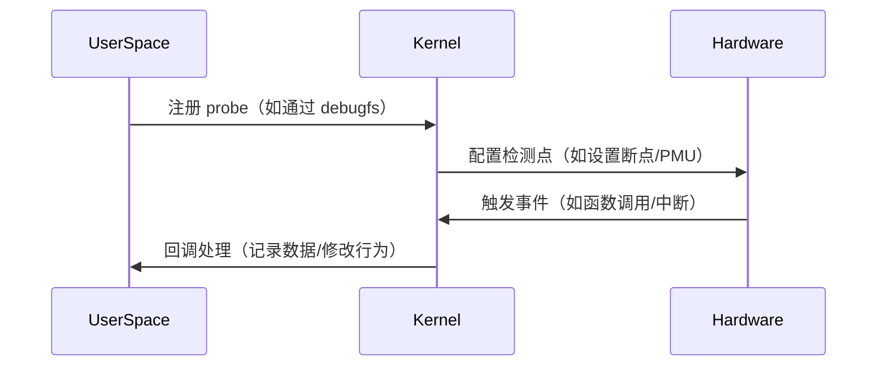

# probe

在 Linux 内核和调试工具中，**"probe"** 是一个通用术语，指 **动态插入的检测点**，用于收集运行时数据或修改行为。

**Probe（探针）** 的本质是：
**在代码的关键路径上插入一个可动态启用的钩子**，用于：

- **数据采集**（如记录函数参数、返回值）
- **行为干预**（如修改参数、阻止操作）
- **性能分析**（如统计调用频率、耗时）



# mips

MIPS（Microprocessor without Interlocked Pipeline Stages）是**一种经典的RISC架构**，主要特点包括：

- **精简指令集**：固定长度指令（32位或64位），流水线高效
- **寄存器丰富**：32个通用寄存器（$0-$31）
- **应用领域**：嵌入式系统、路由器（如Broadcom SoC）、早期游戏机（PS1/PS2）等

在Linux内核中，MIPS相关功能主要通过以下方式实现：

1. **内核配置选项（Kconfig）**

   ```ini
   # arch/mips/Kconfig
   config MIPS
       bool "MIPS architecture"
       select ...
       help
         Linux support for MIPS processors.
   ```

   关键子选项：

   - **CPU类型选择**（MIPS32/MIPS64、特定型号如Loongson、Broadcom）
   - **ABI支持**（O32/N32/N64调用约定）
   - **FPU/MMU支持**
   - **多核/SMP支持**

2. **关键代码路径**

   - **处理器初始化**：`arch/mips/kernel/cpu-probe.c`
   - **异常处理**：`arch/mips/kernel/traps.c`
   - **内存管理**：`arch/mips/mm/`
   - **平台相关代码**：`arch/mips/{loongson, broadcom, ...}`

> **典型功能实现示例**

1. **DDR 控制器驱动**

   MIPS平台上的DDR控制通常涉及：

   ```c
   // arch/mips/boot/ddr/setup.c
   void mips_ddr_init(void)
   {
       /* 1. 配置DDR时序参数 */
       write_reg(DDR_TIMING_REG, 0x123456);
   
       /* 2. 校准阻抗 */
       if (config_enabled(CONFIG_DDR_CALIBRATION))
           ddr_phy_calibrate();
   
       /* 3. 启用带宽统计 */
   #ifdef CONFIG_DDR_DDRC_FLUX
       register_ddr_flux_handler();
   #endif
   }
   ```

2. **性能监控（perf）**

   MIPS定义了自己的PMU事件：

   ```c
   // arch/mips/kernel/perf_event_mips.c
   static const struct mips_pmu_event mips_pmu_events[] = {
       [0] = { .name = "cycles", .event_id = 0x00 },
       [1] = { .name = "instructions", .event_id = 0x01 },
       /* DDR相关事件 */
       [5] = { .name = "ddr-reads", .event_id = 0x25 },
   };
   ```

> **用户空间工具链支持**

开发MIPS需配套工具链：

- **编译器**：`mips-linux-gnu-gcc`

- **调试器**：`gdb-multiarch`

- **内核构建**：

  ```sh
  make ARCH=mips CROSS_COMPILE=mips-linux-gnu- menuconfig
  make ARCH=mips CROSS_COMPILE=mips-linux-gnu-
  ```

> **调试与追踪**

1. **通过/proc接口**

   ```sh
   # 查看CPU信息
   cat /proc/cpuinfo | grep -i mips
   
   # 监控DDR使用（需驱动支持）
   cat /proc/ddr_debug/bandwidth
   ```

2. **使用JTAG工具**

   OpenOCD配置：

   ```tcl
   adapter driver jlink
   transport select jtag
   set _CHIPNAME mips
   jtag newtap $_CHIPNAME cpu -irlen 5 -expected-id 0x12345678
   ```

   

# 快速查找命令

```sh
grep "搜索内容" *           # 当前目录所有文件
grep "搜索内容" *.txt       # 所有.txt 文件
grep -r "搜索内容" .        # 递归搜索当前目录及子目录
find . -name "*.c" -exec grep "main" {} +   # 在所有.c 文件中查找 "main"
```

# 内核目录结构

```ini
kernel/
├── sched/               # 进程调度子系统
│   ├── core.c           # 调度器核心逻辑（如任务切换、负载均衡）
│   ├── fair.c           # CFS（完全公平调度器）实现
│   ├── rt.c             # 实时调度器（SCHED_FIFO/SCHED_RR）
│   ├── deadline.c       # Deadline 调度器（SCHED_DEADLINE）
│   ├── idle.c           # CPU Idle 调度管理
│   └── ...              
│
├── time/                # 时间管理
│   ├── tick-common.c    # Tick 中断处理
│   ├── clocksource.c    # 时钟源管理
│   └── timer.c          # 高精度定时器（hrtimer）
│
├── irq/                 # 中断处理
│   ├── handle.c         # 中断入口逻辑
│   ├── chip.c          # 中断控制器抽象
│   └── ...              
│
├── locking/             # 锁机制
│   ├── mutex.c          # 互斥锁（mutex）
│   ├── spinlock.c       # 自旋锁
│   └── rwsem.c         # 读写信号量
│
├── power/               # 电源管理
│   ├── suspend.c        # 系统挂起/恢复
│   ├── cpu.c           # CPU 频率调节（CPUFreq）
│   └── ...              
│
├── rcupdate/            # RCU（Read-Copy-Update）机制
│   ├── rcu.c            # RCU 核心实现
│   └── tree.c          # 树形 RCU 优化
│
├── bpf/                 # BPF（Berkeley Packet Filter）
│   ├── core.c           # BPF 虚拟机核心
│   └── verifier.c      # BPF 程序验证器
│
├── tracing/             # 内核跟踪（Trace）
│   ├── trace.c          # Trace 框架核心
│   ├── ftrace.c        # 函数跟踪（Ftrace）
│   └── ...              
│
├── module/              # 内核模块管理
│   ├── main.c           # 模块加载/卸载
│   └── ...              
│
├── fork.c               # 进程创建（fork/clone）
├── exit.c               # 进程退出
├── panic.c              # 内核崩溃处理
└── ...
```

**其他重要目录（同级）**

- **`mm/`**：内存管理（页分配、SLAB/SLUB、VM）。
- **`net/`**：网络协议栈（TCP/IP、Socket、Netfilter）。
- **`drivers/`**：设备驱动（GPU、存储、网络设备等）。
- **`arch/`**：CPU 架构相关代码（x86、ARM、RISC-V）。

# 小核和大核

| **特性**     | **大核 (Big Core)**        | **小核 (Little Core)**       |
| :----------- | :------------------------- | :--------------------------- |
| **设计目标** | 高性能计算                 | 高能效比（省电）             |
| **微架构**   | 复杂流水线、多发射、大缓存 | 简单流水线、精简结构、小缓存 |
| **时钟频率** | 高（如 3.0 GHz+）          | 低（如 1.5~2.5 GHz）         |
| **功耗**     | 高（可能达数十瓦）         | 低（通常<1W/核心）           |
| **适用场景** | 游戏、视频渲染等重负载任务 | 后台任务、待机、轻负载       |

# 宏内核和微内核

| **特性**     | **宏内核**                                                   | **微内核**                                                   |
| :----------- | :----------------------------------------------------------- | :----------------------------------------------------------- |
| **核心思想** | 所有核心功能（调度、文件系统、驱动等）运行在内核态，高度集成。 | 仅最基础功能（IPC、调度、内存管理）在内核态，其他功能（如文件系统、驱动）运行在用户态。 |
| **模块交互** | 通过函数调用直接通信（高性能）。                             | 通过进程间通信（IPC）交互（高隔离性）。                      |
| **典型代表** | Linux、Unix、Windows 9x。                                    | QNX、MINIX、L4、macOS（部分混合设计）。                      |

**IPC（Inter-Process Communication，进程间通信）**

# `for_each_compatible_node(dn, type, compatible)`

```c
#define for_each_compatible_node(dn, type, compatible) \
    for (dn = of_find_compatible_node(NULL, type, compatible); dn; \
         dn = of_find_compatible_node(dn, type, compatible))
```

 Linux 内核提供的一个 **设备树（Device Tree）遍历宏**，用于查找并按顺序处理所有匹配特定 **兼容性字符串（compatible）** 的节点。

# 异常级别ELs

在 **ARMv8-A 架构**（支持 64 位 ARM 的处理器，如 Cortex-A 系列）中，**异常级别（Exception Levels, ELs）** 定义了 CPU 执行权限的分层模型，从高到低依次为 `EL3`、`EL2`、`EL1` 和 `EL0`。其中 **`EL0` 和 `EL1`** 是最常用的两级，分别对应 **用户态** 和 **内核态**。

| **特性**     | **EL0（用户态）**  | **EL1（内核态）**            |
| :----------- | :----------------- | :--------------------------- |
| **权限**     | 最低（受限）       | 最高（特权）                 |
| **运行代码** | 应用程序           | 操作系统内核                 |
| **硬件访问** | 必须通过系统调用   | 直接访问                     |
| **内存管理** | 仅限用户空间       | 可修改页表、管理所有进程内存 |
| **典型指令** | `SVC` 触发系统调用 | `MSR`、`MRS`、`ERET`         |

- **EL2**：运行虚拟机监控程序（如 KVM）。
- **EL3**：运行安全固件（如 ARM TrustZone）。

# SDK

**SDK（软件开发工具包）** 是一套由平台或框架提供的工具集合，旨在帮助开发者高效构建特定环境下的应用程序。它通常包含 **库文件、API文档、示例代码、调试工具** 等，用于简化开发流程并标准化技术栈。

| 组件                  | 作用                                                         |
| :-------------------- | :----------------------------------------------------------- |
| **API 库**            | 预编译的动态/静态库（如 `.dll`、`.so`、`.a`），提供核心功能调用接口。 |
| **头文件（Headers）** | C/C++ 中的 `.h` 文件，定义函数原型、数据结构（如 OpenGL 的 `gl.h`）。 |
| **文档**              | 官方指南、API 参考（如 Android SDK 的开发者网站）。          |
| **工具链**            | 编译器、调试器、打包工具（如 Android SDK 的 `adb`、`fastboot`）。 |
| **示例代码**          | 演示典型用法的代码片段（如 iOS SDK 的 Xcode 项目模板）。     |
| **模拟器/仿真器**     | 虚拟运行环境（如 Android Emulator、游戏引擎的调试视图）。    |

# ext4

**第四代扩展文件系统**（**Fourth Extended Filesystem**）

# ide

“IDE” 是 **Integrated Development Environment**（集成开发环境）的缩写，是一种为程序员提供的软件开发工具，集成了代码编辑、编译、调试、版本控制等多种功能于一体，以提高开发效率。

# Linux current机制

在 Linux 内核中，**`current`** 机制（用于获取当前正在运行的进程的 `task_struct` 指针）的实现依赖于体系结构（arch-specific），但核心定义通常涉及以下几个关键文件：

> current在arm和arm64上的实现

在linux 内核中，有一个current宏，通过该宏，可以获取当前进程的task_struct数据结构。在arm上，就是利用了内核栈特性来实现的，记录如下：

首先，如果没有在**arch/xxx/include/asm/**目录下没有定义该宏，则该宏定义在**include/asm-generic/current.h**文件中，如下所示：

```c
	/* SPDX-License-Identifier: GPL-2.0 */
	#ifndef __ASM_GENERIC_CURRENT_H
	#define __ASM_GENERIC_CURRENT_H

	#include <linux/thread_info.h>

	#define get_current() (current_thread_info()->task)
	#define current get_current()

	#endif /* __ASM_GENERIC_CURRENT_H */
```

在arm32架构中，current就是定义在上述文件的，而在arm64中，在打上以下这个补丁之前，实现也是如arm32一样，但打上以下补丁后，current就定义在**arch/arm64/include/asm/current.h**这个文件中。

打上以上补丁后，arm64上current的实现如下：

```c
/* SPDX-License-Identifier: GPL-2.0 */
#ifndef __ASM_CURRENT_H
#define __ASM_CURRENT_H

#include <linux/compiler.h>

#ifndef __ASSEMBLY__

struct task_struct;

/*
 * We don't use read_sysreg() as we want the compiler to cache the value where
 * possible.
 */
static __always_inline struct task_struct *get_current(void)
{
	unsigned long sp_el0;

	asm ("mrs %0, sp_el0" : "=r" (sp_el0));

	return (struct task_struct *)sp_el0;
}

#define current get_current()

#endif /* __ASSEMBLY__ */

#endif /* __ASM_CURRENT_H */
```

# EXPORT_SYMBOL

`EXPORT_SYMBOL` 是 Linux 内核中用于 **导出内核符号** 的关键宏，使其他内核模块可以访问该符号（函数或变量）。以下是详细说明：

| 宏定义                | 用途                            |
| :-------------------- | :------------------------------ |
| `EXPORT_SYMBOL()`     | 基本导出，所有模块可见          |
| `EXPORT_SYMBOL_GPL()` | 仅限GPL协议模块使用（法律约束） |

# Linux Netlink机制

Netlink 是 Linux 内核提供的一种用于**内核与用户空间进程通信的机制**，它是一种基于套接字(socket)的通信方式。

> Netlink 地址族

Netlink 使用自己的地址族(AF_NETLINK)，每个Netlink套接字使用以下地址结构：

```c
struct sockaddr_nl {
    sa_family_t nl_family;  // AF_NETLINK
    unsigned short nl_pad;   // 填充，通常为0
    pid_t nl_pid;           // 进程PID或多播组ID
    __u32 nl_groups;        // 多播组掩码
};
```

> Netlink 消息格式

Netlink 消息由消息头和有效载荷组成：

```c
struct nlmsghdr {
    __u32 nlmsg_len;    // 消息总长度
    __u16 nlmsg_type;   // 消息类型
    __u16 nlmsg_flags;  // 标志位
    __u32 nlmsg_seq;    // 序列号
    __u32 nlmsg_pid;    // 发送方PID
};
```

> 常用 Netlink 协议族

Linux 内核定义了多种 Netlink 协议族，用于不同子系统：

- NETLINK_ROUTE: 路由和链路信息
- NETLINK_KOBJECT_UEVENT: 内核事件通知
- NETLINK_GENERIC: 通用Netlink框架
- NETLINK_SOCK_DIAG: 套接字监控
- NETLINK_FIREWALL: 防火墙相关
- NETLINK_AUDIT: 审计子系统

# Linux内核同步机制


# Linux内存管理与链表


# Linux任务与调度


## 软中断机制

### 软中断原理 

硬件中断是硬件产生的中断信号，硬件产生中断后，会将中断通知给 CPU，CPU 查询向量表（**中断向量表**）将中断映射成具体的服务程序。

软中断是软件模拟的中断，软中断完全在操作系统内 部实现，**内核运行一个守护线程来实现中断查询与执行**，这个线程的功能类似于处理器的中 断控制器功能。

构成软中断机制的核心元素包括：软中断状态（soft interrupt state）、 软中断 向量表（softirq_vec）、软中断线程（softirq thread）


Linux 下的软中断机制在 Linux 内核代码的/kernel/softirq.c 中实现。软中断的行为用 softirq_action 描述。软中断存放在软中断向量表中。Linux 4.5 内核目前最多可以有 10 种软 中断，包括定时器、网络软中断、tasklet 等。

```c
struct softirq_action 
{ 
	void （*action）（struct softirq_action *）； 
}； 
static struct softirq_action softirq_vec[NR_SOFTIRQS] __cacheline_aligned_in_smp； //软中断向量表
```

系统在 **ksoftirqd 内核进程**中调用__do_softirq 循环检测软中断是否处于 pending 状态，如 果是，则执行相应的处理函数。

```c
asmlinkage __visible void __do_softirq（void） 
{ 
    unsigned long end = jiffies + MAX_SOFTIRQ_TIME； 
    unsigned long old_flags = current->flags； 
    int max_restart = MAX_SOFTIRQ_RESTART； 
    struct softirq_action *h； 
    bool in_hardirq； 
    __u32 pending； 
    int softirq_bit； 
    current->flags &= ～PF_MEMALLOC； 
    pending = local_softirq_pending（）； 
    account_irq_enter_time（current）； 
    __local_bh_disable_ip（_RET_IP_， SOFTIRQ_OFFSET）； 
    in_hardirq = lockdep_softirq_start（）； 
    restart： 
    /*在使能中断前复位 pending 掩码*/ 
    set_softirq_pending（0）； 
    local_irq_enable（）； 
    h = softirq_vec； 
    while （（softirq_bit = ffs（pending））） { 
        unsigned int vec_nr； 
        int prev_count； 
        h += softirq_bit - 1； 
        vec_nr = h - softirq_vec； 
        prev_count = preempt_count（）； 
        kstat_incr_softirqs_this_cpu（vec_nr）； 
        trace_softirq_entry（vec_nr）； 
        h->action（h）；			//调用软中断函数
        trace_softirq_exit（vec_nr）； 
        if （unlikely（prev_count ！= preempt_count（））） { 
            pr_err（"huh， entered softirq %u %s %p with preempt_count %08x， exited with %08x？\n"， 
            vec_nr， softirq_to_name[vec_nr]， h->action， 
            prev_count， preempt_count（））； 
            preempt_count_set（prev_count）； 
        } 
        h++； 
        pending >>= softirq_bit； 
    } 
    rcu_bh_qs（）； 
    local_irq_disable（）； 
    pending = local_softirq_pending（）； 
    if （pending） { 
        if （time_before（jiffies， end） && ！need_resched（） && --max_restart） 
        	goto restart； 
        wakeup_softirqd（）； 
    } 
    lockdep_softirq_end（in_hardirq）； 
    account_irq_exit_time（current）； 
    __local_bh_enable（SOFTIRQ_OFFSET）； 
    WARN_ON_ONCE（in_interrupt（））；
    tsk_restore_flags（current， old_flags， PF_MEMALLOC）； 
}
```

Linux 内核中定义了下列软中断优先级：

```c
enum 
{ 
    HI_SOFTIRQ=0， //高优先软中断
    TIMER_SOFTIRQ， //定时器
    NET_TX_SOFTIRQ， //网络发送
    NET_RX_SOFTIRQ， //网络接收
    BLOCK_SOFTIRQ， //块层设备
    IRQ_POLL_SOFTIRQ， 
    TASKLET_SOFTIRQ， // TASKLET 
    SCHED_SOFTIRQ， //调度
    HRTIMER_SOFTIRQ， 
    RCU_SOFTIRQ， /*RCU 中断*/ 
    NR_SOFTIRQS 
}； 
```

各种软中断的优先级与处理函数：

| 软中断类型       | 优先级 | 处理函数              |
| :--------------- | :----- | :-------------------- |
| HI_SOFTIRQ       | 0      | tasklet_hi_action     |
| TIMER_SOFTIRQ    | 1      | run_timer_softirq     |
| NET_TX_SOFTIRQ   | 2      | net_tx_action         |
| NET_RX_SOFTIRQ   | 3      | net_rx_action         |
| BLOCK_SOFTIRQ    | 4      | blk_done_softirq      |
| IRQ_POLL_SOFTIRQ | 5      | irq_poll_softirq      |
| TASKLET_SOFTIRQ  | 6      | tasklet_action        |
| SCHED_SOFTIRQ    | 7      | run_rebalance_domains |
| HRTIMER_SOFTIRQ  | 8      | run_hrtimer_softirq   |
| RCU_SOFTIRQ      | 9      | rcu_process_callbacks |

内核在软中断子系统初始化时启动了 tasklet 与高优先软中断：

```c
void __init softirq_init（void） 
{ 
    int cpu； 
    for_each_possible_cpu（cpu） { 
        per_cpu（tasklet_vec， cpu）.tail = 
        &per_cpu（tasklet_vec， cpu）.head； 
        per_cpu（tasklet_hi_vec， cpu）.tail = 
        &per_cpu（tasklet_hi_vec， cpu）.head； 
    }
    // 启动 tasklet 与高优先软中断
    open_softirq（TASKLET_SOFTIRQ， tasklet_action）； 
    open_softirq（HI_SOFTIRQ， tasklet_hi_action）； 
}
```

### tasklet

软中断是利用软件模拟的中断机制，常用来执行异步任务。**tasklet 是利用软中断实现的 一种下半部机制**。tasklet 结构体定义如下：

```c
struct tasklet_struct 
{ 
    struct tasklet_struct *next； 	/*队列指针*/ 
    unsigned long state； 			/*tasklet 的状态*/ 
    atomic_t count； 				/*引用计数，通常用 1 表示 disabled*/ 
    void （*func）（unsigned long）； /*执行函数指针*/ 
    unsigned long data； 
}； 
```

调度 tasklet 使用 tasklet_schedule 函数：

```c
void tasklet_schedule（struct tasklet_struct *t）； 
void tasklet_hi_schedule（struct tasklet_struct *t）； //和 tasklet_schedule 类似，优先级更高
```

使用 tasklet_kill 函数可删除 tasklet：

```c
void tasklet_kill（struct tasklet_struct *t）； 
```

如果 tasklet 正在运行， tasklet_kill 函数将等待直到它执行完毕。 使能和禁止 tasklet 的函数如下：

```c
//禁止 tasklet 被 tasklet_schedule 调度，如果该 tasklet 当前正在执行，这个函数会等到它执行完
毕再返回。
void tasklet_disable（struct tasklet_struct *t）； 
//和 tasklet_disable 类似，但是它不等待 tasklet 执行完就返回。
void tasklet_disable_nosync（struct tasklet_struct *t）； 
//使能一个之前被 disable 的 tasklet 
void tasklet_enable（struct tasklet_struct *t）； 
```

使用 tasklet 机制的三个步骤是： 

（1）编写 tasklet 处理程序：

```c
static void tasklet_callback（unsigned long data） 
{ 
	printk（KERN_ALERT "received a interrupt.\n"）； 
} 
```

（2）声明 tasklet：

```c
DECLARE_TASKLET（tasklet， tasklet_callback， 0）；
```

（3）调度 tasklet：

```c
static irqreturn_t irq_handler（int irq， void *arg） 
{ 
    tasklet_schedule（&tasklet）； 
    return IRQ_HANDLED； 
} 
```

## 工作队列

### 工作队列原理

工作队列（work queue）类似 tasklet，允许调用者请求在将来某个时间调用一个函数。

Linux 内核提供了一系列全局 work queue ，包括 system_wq 、 system_highpri_wq 等。**驱动程序可以创建并使用它们自己的工作队列，或者使用内核的一个全局工作队列**。

工作队列用 workqueue_struct 结构描述，而任务用 work_struct 结构描述。工 作队列初始化接口如下：

```c
//创建工作队列，在这里 name 是工作队列的名字。
#define create_workqueue（name） \ 
 alloc_workqueue（"%s"， __WQ_LEGACY | WQ_MEM_RECLAIM， 1， （name）） 
#define create_singlethread_workqueue（name） \ 
 alloc_ordered_workqueue（"%s"， __WQ_LEGACY | WQ_MEM_RECLAIM， name） 
//在编译期初始化一个任务
DECLARE_WORK（struct work_struct *work， void （*function）（ struct work_struct *））； 
//在运行期初始化一个任务
INIT_WORK（struct work_struct *work， void （*function）（ struct work_struct *））； 
```

create_workqueue 宏用于创建一个工作队列，它在系统的**每个处理器上有一个专用的线程**。

在很多情况下，过多线程对系统性能有影响，如果单个线程就足够则使用 create_  singlethread_workqueue 宏来创建工作队列。

可以用下面的函数调用把一个任务加入到工作队列中：

```c
bool queue_work（struct workqueue_struct *wq，struct work_struct *work） 
int fastcall queue_delayed_work（struct workqueue_struct *wq，struct work_struct *work， unsigned long delay）；
```

在 queue_delayed_work（）中指定 delay，是为了保证至少在经过一段给定的**最小延迟时间**以后，工作队列中的任务才可以真正执行。

取消工作队列中没有运行的任务：

```c
int cancel_delayed_work（struct work_struct *work）；
```

如果当一个取消操作的调用返回时，任务正在执行中，那么这个任务将继续执行下去， 但不会再加入到队列中。

```c
//确保调度队列中的工作队列执行完毕，这个函数会等待工作队列执行完毕再返回。
void fastcall flush_workqueue（struct workqueue_struct *wq）；
//销毁工作队列
void destroy_workqueue（struct workqueue_struct *wq）；
//将工作置入全局工作队列
int fastcall schedule_work（struct work_struct *work）；
//延迟一段时间后将任务置入全局工作队列
int fastcall schedule_delayed_work（struct work_struct *work， unsigned long delay）；
```

### 延迟工作队列 

延迟工作队列基于工作队列，可以实现延迟一段时间再将工作加入到工作队列：

```c
struct delayed_work { 
    struct work_struct work； 
    struct timer_list timer；//延迟时间
    struct workqueue_struct *wq； 
    int cpu； 
}；
```

延迟工作队列相关的函数如下：

```c
INIT_DELAYED_WORK（struct delayed_work*dw， void （*function）（ struct work_struct *））； 
bool queue_delayed_work（struct workqueue_struct *wq，struct delayed_work *dwork，unsigned long delay）； 
bool schedule_delayed_work（struct delayed_work *dwork，unsigned long delay）； 
bool cancel_delayed_work（struct delayed_work *dwork）； 
```

​																																																																			

# AOSP

**AOSP**（Android Open Source Project，安卓开源项目）是 Google 主导的 **Android 操作系统开源版本**，提供了 Android 系统的核心框架、底层驱动和基础应用。它是**所有 Android 设备（如手机、平板、电视等）的基础**，厂商可以基于 AOSP 定制自己的 ROM（如 MIUI、ColorOS 等）。

| 模块                                  | 说明                                                         |
| :------------------------------------ | :----------------------------------------------------------- |
| **Linux Kernel**                      | Android 基于 Linux 内核，提供硬件驱动、进程管理、内存管理等基础功能。 |
| **HAL（Hardware Abstraction Layer）** | 硬件抽象层，让 Android 兼容不同硬件（如摄像头、蓝牙）。      |
| **Android Runtime (ART)**             | Android 应用的运行时环境，替代早期的 Dalvik 虚拟机，优化性能。 |
| **Framework**                         | 提供 API 接口（如 Activity Manager、Window Manager），供 App 调用。 |
| **System Apps**                       | 基础应用（如电话、短信、设置），部分由 Google 提供（如 GMS 需额外授权）。 |

| 特性         | AOSP（原生安卓）     | 厂商 ROM（如 MIUI、EMUI） |
| :----------- | :------------------- | :------------------------ |
| **代码来源** | Google 官方开源      | 基于 AOSP 深度定制        |
| **更新速度** | 跟随 Google 发布     | 厂商适配后延迟推送        |
| **预装应用** | 仅基础应用（无 GMS） | 含厂商/第三方应用         |
| **UI 界面**  | 原生 Material Design | 厂商自定义 UI（如 MIUI）  |
| **兼容性**   | 通用性强             | 可能对某些 App 优化/限制  |

1. **定制 ROM 开发**
   - 厂商（如小米、三星）基于 AOSP 开发自己的系统（如 MIUI、One UI）。
   - 开发者可制作第三方 ROM（如 LineageOS）。
2. **系统级研究与逆向**
   - 分析 Android 底层机制（如 Binder、HAL）。
   - 安全研究（漏洞挖掘、权限机制分析）。
3. **嵌入式设备开发**
   - 智能电视、车载系统（Android Automotive）等非手机设备。
4. **App 开发者调试**
   - 在没有真机时，用 AOSP 模拟器测试系统级功能。


# DMA控制器

DMA（直接内存访问）控制器是一种 **硬件模块**，用于在 **不占用 CPU 资源** 的情况下，直接在 **外设（如磁盘、网卡、摄像头）和内存** 之间高速传输数据。它是提升系统性能（尤其是 I/O 密集型任务）的关键组件。

> **DMA 的核心作用**

- **解放 CPU**：避免 CPU 陷入频繁的数据搬运（如磁盘读写、网络包传输）。
- **提高吞吐量**：支持高速数据传输（如 PCIe、USB 3.0）。
- **降低功耗**：减少 CPU 参与，节省能耗（对移动设备尤为重要）。

> **DMA 的工作原理**

1. **初始化配置**：
   - CPU 设置 DMA 控制器的 **源地址**（如外设寄存器）、**目标地址**（内存）、**数据长度**。
2. **触发传输**：
   - 外设或 CPU 发送请求，DMA 控制器接管总线控制权。
3. **数据传输**：
   - DMA 控制器直接读写内存，无需 CPU 介入。
4. **传输完成中断**：
   - DMA 控制器通知 CPU 数据就绪（通过中断）。

| **模式**       | **描述**                                                     |
| :------------- | :----------------------------------------------------------- |
| **内存到外设** | 将内存中的数据发送到外设（如网卡发送数据包）。               |
| **外设到内存** | 从外设读取数据到内存（如摄像头采集图像）。                   |
| **内存到内存** | 在内存不同区域间拷贝数据（较少用，通常由 CPU 或专用加速器处理）。 |

# 侵入式链表

侵入式链表是一种 **数据结构设计模式**，其特点是 **链表节点直接嵌入到目标数据结构中**，而非额外分配节点内存。这种设计在系统编程（如操作系统内核、高性能库）中广泛应用，典型代表包括 Linux 内核的 `list_head`。

> 普通链表：


> 侵入式链表


> 内核链表


>  如何从侵入式链表指针中得到对象的指针？

内核中 `offsetof`、`container_of` 这两个神奇的宏，使用这两个宏，在给定链表结构地址时，我们能够获取其宿主结构的地址。

# 关于malloc底层slab和内存池的区别

用户态内存池的存在本质是**对SLAB的补充而非替代**，核心解决的是：

1. **系统调用开销**（内核-用户态切换）
2. **锁竞争**（通过线程本地化）
3. **业务定制化**（特殊分配策略）

| **维度**     | **内核SLAB/SLUB**                  | **用户态内存池**                           |
| :----------- | :--------------------------------- | :----------------------------------------- |
| **核心目标** | 减少内核碎片、保证安全性和稳定性   | 极致性能优化，减少系统调用和锁竞争         |
| **适用场景** | 内核对象（如task_struct, inode等） | 用户态高频小对象（如网络连接、数据库请求） |
| **调用成本** | 仍需走系统调用（brk/mmap）         | **完全避开系统调用，无上下文切换开销**     |
| **锁竞争**   | 全局锁（如SLUB的`kmem_cache`锁）   | 可设计为线程本地存储（TLS）无锁分配        |

# Kconfig文件

KConfig文件一般使用menuconfig命令可视化配置，配置完成后被保存为`.config`文件。然后又将`.config`文件转化成`xxx.h`文件。这样c语言就可以识别使用了。

> 语法：

1. KConfig语法使用`菜单项`作为基本组成单位。每个`菜单项`都有自己的相关属性(`菜单项属性`)。菜单项之间可以嵌套。
2. 使用`#`作为注释符.

> KConfig的菜单项

1. `config`菜单项: 定义一个配置选项。可以接受所有的菜单项属性。是语法中最常用的一个菜单项。语法格式为

   ```c
   //格式
   "config" <symbol>
       <config options>
   //eg:
   config CONFIG_USING_XXX
       bool "this is use xxx"
       default n
   ```

2. `menuconfig`菜单项:定义一个配置选项类似`config`菜单项。它常常配合`if`块使用。只有`menuconfig`菜单项选中时，才会展现if中的配置选项。

   ```c
   //格式
   "menuconfig" <symbol>
       <config options>
   //eg:
   ```

3. `mainmenu`菜单项::这将设置配置程序的标题栏，如果配置程序选择使用它。它应该放在配置的顶部，在任何其他语句之前。

   ```c
   //格式
   "mainmenu" info
       <config options>
   //eg:
   mainmenu "KConfig test"
   
   config CONFIG_USING_XXX
       bool "this is use xxx"
       default n
   ```

4. `choice/endchoice`菜单项::选择器

   ```c
   //格式
   "choice" [symbol]
       <choice options>
       <choice block>
   "endchoice"
   //eg:
   choice
       prompt "Version"
       default PKG_USING_LITTLED_LATEST_VERSION
       help
           Select the package version
   
       config PKG_USING_LITTLED_V020
           bool "v0.2.0"
   
       config PKG_USING_LITTLED_LATEST_VERSION
           bool "latest"
   endchoice
   ```

5. `menu/endmenu`菜单项:定义一个菜单块。

   ```c
   //格式
       "menu" <prompt>
       <menu options>
       <menu block>
       "endmenu"
   //eg:
   menu "menu test"
       config CONFIG_USING_XXX
           bool "this is use xxx"
           default n
   
       config CONFIG_USING_XXXy
           bool "this is use xxx"
           default y
   endmenu
   ```

6. `comment`菜单项: 添加注释,这个注释在配置文件转化成.h文件时也会转换成注释。

   ```c
   //格式
   "comment" <prompt>
   <comment options>
   //eg:
   comment "this is set period"
   config CONFIG_USING_XXX
   int "default pwm period (ms)"
   range 1 1000
   default 1000
   ```

7. `if/endif`菜单项:定义一个if条件判断块

   ```c
   //格式
   "if" <expr>
       <if block>
   "endif"
   //eg:
       if RT_USING_USER_MAIN
       config RT_MAIN_THREAD_STACK_SIZE
           int "Set main thread stack size"
           default 2048
       config RT_MAIN_THREAD_PRIORITY
           int "Set main thread priority" 
           default 4  if RT_THREAD_PRIORITY_8
   endif
   ```

8. `source`菜单项: 将其他的Kconfig文件加入到此位置,并解析显示。

   ```c
   //格式
   "source" <prompt>
   //eg:
   source "./xxx/Kconfig"
   ```

> 菜单项属性

1. 每个菜单项必须选择一种类型定义
   1. `bool`:二值量。取值为`y`或者`n`。
   2. `int`:十进制整型数
   3. `hex`:十六进制整型数
   4. tristate:三态量。取值为
      1. `y`:选中
      2. `n`:不选中
      3. `m`: 编译成模块
   5. `string`:字符串
2. `输入提示`(input prompt):每个菜单项最多只有一个输入提示。可以使用“if”添加仅针对此提示的可选依赖项。
3. `default`(默认值):在用户没有对其设置时它使用默认值。配置选项可以有任意数量的默认值。如果多个默认值是可见的，则只有第一个定义的值是活动的。默认值不局限于定义它们的菜单项。这意味着默认值可以在其他地方定义，也可以由以前的定义覆盖。
4. `类型定义+默认值`:是上面两个的简写。eg:`bool "this is test"`。
5. `depends on`(菜单项依赖):这个菜单项所依赖的菜单项,只有所依赖的菜单项被选中,当前的菜单项才会出现。如果有多个依赖，使用`&&`连接。这个属性一般多用`if`语句代替。
6. `select`(反向依赖),当前配置被选中,则此依赖也会被选中。他只能用在bool、tristate类型的菜单项中。
7. `visible if <expr>`(限制菜单显示): 此属性仅适用于菜单块，如果条件为false，则菜单块不会显示给用户(但包含在其中的符号仍然可以由其他符号选择)。“可见”的默认值为真。
8. `range min max`(数值范围):限制`int`、`hex`类型的范围。大于等于min并且小于等于max
9. 帮助信息:`help`或者`"---help---"`它的结束由缩进决定。可以使用`?`查看.
10. 其他属性:
    1. defconfig_list
    2. modules
    3. `env=<value>`:将环境变量导入Kconfig.


# CPU缓存

[计算机组成原理：CPU Cache（高速缓存）-CSDN博客](https://blog.csdn.net/zhizhengguan/article/details/121274383)


访问CPU寄存器中的数据，只需要一个时钟周期；访问高速缓存中的数据，大概需要几十个时钟周期；如果访问的数据在主存中，需要大概上百个周期；而访问磁盘中的数据则需要大约几千万个周期！


我们现在用的 Intel CPU，通常都是多核的的。每一个 CPU 核里面，都有独立属于自己的L1、L2 的 Cache，然后再有多个 CPU 核共用的 L3 的 Cache、主内存。

无论对 Cache 数据检查、读取还是写入，CPU 都需要知道访问的内存数据映射在 Cache 上的哪个位置，这就是 **Cache - 内存地址映射问题**，映射方案有**直接映射、全相联映射和组相联映射** 3 种方案。当缓存块满或者内存块映射的缓存块位置被占用时，就需要使用 **替换策略** 将旧的 Cache 块换出腾出空闲位置。


> 第一个问题是：我们写入的数据，到达应该写到Cache里还是主内存呢？

1. 写直达（Write-Through）：每一次数据都要写入到主内存里。

   1. 写入前，我们会先去判断数据是否已经在Cache里面了
   2. 如果数据已经在Cache里面，我们就先把数据写入更新到Cache里面，再写入到主内存中
   3. 如果数据不在Cache里面，我们就只更新主内存

2. 写回（Write-Back）：**不再是每次都把数据写入到主内存，而是只写到CPU Cache里。只有当CPU Cache里面的数据都要被“替换”的时候，我们才把数据写入到主内存里面去**。

   1. 如果发现我们要写入的数据，就在CPU Cache里面，那么我们就只是更新CPU Cache里面的数据
   2. 同时，我们会标记CPU Cache里的这个Block是脏（Drity）的。所谓“脏”，就是指这个时候，我们的CPU Cache里面的这个Block的数据，和主内存是不一致的。
   3. 如果我们发现，我们要写入的数据所对应的 Cache Block 里，放的是别的内存地址的数据，那么我们就要看一看，那个 Cache Block 里面的数据有没有被标记成脏的。
      - 如果是脏的话，我们要先把这个 Cache Block 里面的数据，写入到主内存里面。
      - 然后，再把当前要写入的数据，写入到 Cache 里，同时把 Cache Block 标记成脏的。
      - 如果 Block 里面的数据没有被标记成脏的，那么我们直接把数据写入到 Cache 里面，然后再把 Cache Block 标记成脏的就好了。
   4. 在用了写回这个策略之后，我们在加载内存数据到 Cache 里面的时候，也要多出一步同步脏 Cache 的动作。如果加载内存里面的数据到 Cache 的时候，发现 Cache Block 里面有脏标记，我们也要先把 Cache Block 里的数据写回到主内存，才能加载数据覆盖掉Cache

   ```mermaid
   flowchart TD
       Start[Start: Write to Address X] --> CheckCache{Is X in CPU Cache?}
   
       %% Cache Hit 分支
       CheckCache -->|Yes| UpdateCache[Update Data in Cache Block]
       UpdateCache --> MarkDirty[Mark Cache Block as Dirty]
       MarkDirty --> End[End]
   
       %% Cache Miss 分支
       CheckCache -->|No| CheckVictim{Is Victim Cache Block Dirty?}
   
       %% Victim Block 是 Dirty
       CheckVictim -->|Yes| WriteBack[Write Victim Block to Main Memory]
       WriteBack --> LoadNew[Load Address X from Memory to Cache]
       LoadNew --> UpdateCache
   
       %% Victim Block 不是 Dirty
       CheckVictim -->|No| LoadNew
   ```


# CPU缓存一致性

https://www.scss.tcd.ie/Jeremy.Jones/VivioJS/caches/MESI.htm

[12 张图看懂 CPU 缓存一致性与 MESI 协议，真的一致吗？-腾讯云开发者社区-腾讯云 (tencent.com)](https://cloud.tencent.com/developer/article/2197853)

现在 CPU 都是多核的，由于 L1/L2 Cache 是多个核心各自独有的，那么会带来多核心的**缓存一致性（\*Cache Coherence\*）** 的问题，如果不能保证缓存一致性的问题，就可能造成结果错误。

> 假设 A 号核心和 B 号核心同时运行两个线程，都操作共同的变量 i（初始值为 0 ）。这时如果 A 号核心执行了 `i++` 语句的时候，为了考虑性能，使用了我们前面所说的**写回策略**，先把值为 `1` 的执行结果写入到 L1/L2 Cache 中，然后把 L1/L2 Cache 中对应的 Block 标记为脏的，这个时候数据其实没有被同步到内存中的，因为写回策略，只有在 A 号核心中的这个 Cache Block 要被替换的时候，数据才会写入到内存里。
>
> 如果这时旁边的 B 号核心尝试从内存读取 i 变量的值，则读到的将会是错误的值，因为刚才 A 号核心更新 i 值还没写入到内存中，内存中的值还依然是 0。**这个就是所谓的缓存一致性问题，A 号核心和 B 号核心的缓存，在这个时候是不一致，从而会导致执行结果的错误。**

那么，要解决这一问题，就需要一种机制，来同步两个不同核心里面的缓存数据。要实现的这个机制的话，要保证做到下面这 2 点：

- 第一点，某个 CPU 核心里的 Cache 数据更新时，必须要传播到其他核心的 Cache，这个称为**写传播（\*Wreite Propagation\*）**；
- 第二点，某个 CPU 核心里对数据的操作顺序，必须在其他核心看起来顺序是一样的，这个称为**事务的串形化（\*Transaction Serialization\*）**。

> 而对于第二点事务的串形化，我们举个例子来理解它。
>
> 假设我们有一个含有 4 个核心的 CPU，这 4 个核心都操作共同的变量 i（初始值为 0 ）。A 号核心先把 i 值变为 100，而此时同一时间，B 号核心先把 i 值变为 200，这里两个修改，都会「传播」到 C 和 D 号核心。
>
> 那么问题就来了，C 号核心先收到了 A 号核心更新数据的事件，再收到 B 号核心更新数据的事件，因此 C 号核心看到的变量 i 是先变成 100，后变成 200。
>
> 而如果 D 号核心收到的事件是反过来的，则 D 号核心看到的是变量 i 先变成 200，再变成 100，虽然是做到了写传播，但是各个 Cache 里面的数据还是不一致的。
>
> 所以，我们要保证 C 号核心和 D 号核心都能看到**相同顺序的数据变化**，比如变量 i 都是先变成 100，再变成 200，这样的过程就是事务的串形化。

要实现事务串形化，要做到 2 点：

- CPU 核心对于 Cache 中数据的操作，需要同步给其他 CPU 核心；
- 要引入「锁」的概念，如果两个 CPU 核心里有相同数据的 Cache，那么对于这个 Cache 数据的更新，只有拿到了「锁」，才能进行对应的数据更新。

> **总线嗅探**

写传播的原则就是当某个 CPU 核心更新了 Cache 中的数据，要把该事件广播通知到其他核心。最常见实现的方式是**总线嗅探（\*Bus Snooping\*）**。

当 A 号 CPU 核心修改了 L1 Cache 中 i 变量的值，通过总线把这个事件广播通知给其他所有的核心，然后每个 CPU 核心都会监听总线上的广播事件，并检查是否有相同的数据在自己的 L1 Cache 里面，如果 B 号 CPU 核心的 L1 Cache 中有该数据，那么也需要把该数据更新到自己的 L1 Cache。

- 总线嗅探方法很简单， CPU 需要每时每刻监听总线上的一切活动，但是不管别的核心的 Cache 是否缓存相同的数据，都需要发出一个广播事件，这无疑会加重总线的负载。
- 另外，总线嗅探只是保证了某个 CPU 核心的 Cache 更新数据这个事件能被其他 CPU 核心知道，但是并不能保证事务串形化。

> **MESI 协议**

基于总线嗅探机制实现了事务串形化

MESI 协议其实是 4 个状态单词的开头字母缩写，分别是：

- *Modified*，已修改
- *Exclusive*，独占
- *Shared*，共享
- *Invalidated*，已失效

这四个状态来标记 Cache Line 四个不同的状态。

- 「已修改」状态就是我们前面提到的脏标记，代表该 Cache Block 上的数据已经被更新过，但是还没有写到内存里。

- 「已失效」状态，表示的是这个 Cache Block 里的数据已经失效了，不可以读取该状态的数据。

- 「独占」和「共享」状态都代表 Cache Block 里的数据是干净的，也就是说，这个时候 Cache Block 里的数据和内存里面的数据是一致性的。

  - 独占状态的时候，数据只存储在一个 CPU 核心的 Cache 里，而其他 CPU 核心的 Cache 没有该数据。

    这个时候，如果要向独占的 Cache 写数据，就可以直接自由地写入，而不需要通知其他 CPU 核心，因为只有你这有这个数据，就不存在缓存一致性的问题了，于是就可以随便操作该数据。

  - 在「独占」状态下的数据，如果有其他核心从内存读取了相同的数据到各自的 Cache ，那么这个时候，独占状态下的数据就会变成共享状态。

  - 「共享」状态代表着相同的数据在多个 CPU 核心的 Cache 里都有，所以当我们要更新 Cache 里面的数据的时候，不能直接修改，而是要先向所有的其他 CPU 核心广播一个请求，要求先把其他核心的 Cache 中对应的 Cache Line **标记为「无效」状态**，然后再更新当前 Cache 里面的数据。


# 缺页异常

当 CPU 访问虚拟地址时，若发生以下情况之一，会触发 Page Fault：

1. **页面未加载（Not Present）**
   - 页面在虚拟地址空间中存在（已分配），但未载入物理内存（可能在磁盘的 Swap 分区或文件系统中）。
2. **权限不足（Permission Violation）**
   - 进程试图以非法方式访问页面（如写只读页面、用户态访问内核页面）。
3. **非法访问（Invalid Access）**
   - 虚拟地址未分配（如访问 `NULL` 指针或未映射的区域）。

> 处理流程

当 CPU 触发 Page Fault 时，硬件和操作系统协同完成以下步骤：

1. **CPU 捕获异常**
   - MMU 检测到无效页表项（PTE），触发异常，保存现场（寄存器状态）。
2. **内核介入**
   - CPU 切换到内核模式，执行操作系统的缺页处理程序（如 Linux 的 `do_page_fault`）。
3. **原因分析**
   - 内核检查故障地址是否合法（在进程的 VMA 区域中）。
4. **解决方案**
   - **Minor Fault**：直接映射物理页（如 COW 复制页表项）。
   - **Major Fault**：从磁盘加载数据到物理内存（调用文件系统或 Swap 机制）。
   - **Invalid Fault**：向进程发送 `SIGSEGV` 信号（段错误）。
5. **恢复执行**
   - 更新页表，CPU 重新执行触发异常的指令。

# UMA和NUMA

- UMA全称为 Uniform Memory Access，叫做一致性内存访问。多个CPU通过同一根总线来访问内存。无论多个CPU是访问内存的不同内存单元还是相同的内存单元，同一时刻，只有一个CPU能够访问内存。CPU之间通过总线串行的访问内存，所以会出现访问瓶颈！
- NUMA全称为Non-Uniform Memory Access ,非一致性内存访问。每个CPU都分配了一块内存，这样的话，多个CPU可以同时并行访问各自的内存，这样的话，读写内存的效率就上来了。但是当CPU读取其他CPU的内存的时候，需要通过QPI申请访问，是要慢于直接访问本地内存的。

# Linux系统分区

Linux默认可分为3个分区，分别是[boot分区](https://baike.baidu.com/item/boot分区)、[swap分区](https://baike.baidu.com/item/swap分区)和根分区。

```ini
/       - 根分区(20-50GB，所有未指定挂载点的目录)
/home   - 用户数据分区(剩余大部分空间)
swap    - 交换分区(物理内存的1-2倍)
/boot   - 引导分区(200-500MB)
```

高级分区方案：

```ini
/       - 根分区(20-50GB)
/home   - 用户数据
/var    - 经常变化的系统数据(日志等)
/tmp    - 临时文件
/usr    - 应用程序
swap    - 交换分区
/boot   - 引导分区
```

1. **/ (根分区)**：
   - 必须的分区
   - 包含系统核心文件和目录
   - 大小建议：20GB起步(根据用途调整)
2. **/boot**：
   - 存放内核和引导文件
   - 建议大小：200MB-1GB
   - 可单独分区提高安全性
3. **/home**：
   - 用户个人文件和配置
   - 建议单独分区便于重装系统不丢失数据
4. **swap(交换分区)**：
   - 虚拟内存空间
   - 大小建议：
     - 内存<4GB：内存的2倍
     - 内存4-8GB：等于内存大小
     - 内存>8GB：4-8GB即可
5. **/var**：
   - 存放经常变化的系统数据(日志、缓存等)
   - 对服务器建议单独分区
6. **/tmp**：
   - 临时文件
   - 可单独分区并设置特殊权限

# 挂载机制

Linux 通过**挂载**机制将不同分区"拼接"到目录树中：

- 系统启动时，首先挂载**根分区（`/`）**，建立最基本的目录结构（包括 `/home` 目录的空壳）。
- 然后挂载其他分区（如 `/home` 分区）到对应的目录（如 `/home`），覆盖原有的空目录。
- **最终效果**：用户看到的是一个完整的目录树，但实际上不同目录可能来自不同磁盘或分区。

# 流水线

将指令处理过程划分为多个阶段，使多条指令可以重叠执行，从而提高处理器的吞吐率。（细分颗粒度）

> 经典五级流水线

1. **取指（IF, Instruction Fetch）**
   - 从指令存储器中取出指令
2. **译码（ID, Instruction Decode）**
   - 解析指令并读取寄存器值
3. **执行（EX, Execution）**
   - 执行算术逻辑运算
4. **访存（MEM, Memory Access）**
   - 访问数据存储器
5. **写回（WB, Write Back）**
   - 将结果写回寄存器

# 交叉编译

交叉编译是指 **在一种计算机架构（Host）上编译生成另一种架构（Target）的可执行代码** 的过程。

C/C++文件经过预处理，编译，汇编，链接变成可执行文件（日常统称编译）

1. 准备阶段：

   - **确定目标平台**：明确目标系统的架构(如ARM、MIPS、x86等)、操作系统和库依赖
   - **选择工具链**：获取或构建适合目标平台的交叉编译工具链
     - 常用工具链：GCC交叉编译工具链、LLVM/Clang、专用SDK等
   - **设置环境变量**：配置PATH和其他相关变量指向交叉编译工具

2. 工具链组成：

   典型的交叉编译工具链包含：

   - **交叉编译器**(如arm-linux-gnueabi-gcc)
   - **交叉汇编器**
   - **交叉链接器**
   - **目标系统库和头文件**
   - 其他辅助工具(objdump, nm, strip等)

3. 配置和编译流程

   1. **获取源代码**：下载需要交叉编译的软件源代码
   2. **配置构建系统**：
      - 设置交叉编译参数
      - 指定目标平台(通常通过--host参数)
      - 示例：`./configure --host=arm-linux-gnueabi`
   3. **编译**：
      - 使用交叉编译工具链进行编译
      - 示例：`make CC=arm-linux-gnueabi-gcc`
   4. **处理依赖**：
      - 确保所有依赖库也针对目标平台交叉编译
      - 可能需要指定库的交叉编译版本路径

4. 常见构建系统配置方法

   - Autotools项目

     ```ini
     ./configure --host=arm-linux-gnueabi \
                --prefix=/path/to/target/rootfs \
                CC=arm-linux-gnueabi-gcc \
                CXX=arm-linux-gnueabi-g++
     make
     make install
     ```

   - CMake项目

     ```ini
     mkdir build && cd build
     cmake -DCMAKE_TOOLCHAIN_FILE=../toolchain.cmake ..
     make
     ```

   - 手动指定编译器

     ```ini
     make CC=arm-linux-gnueabi-gcc CXX=arm-linux-gnueabi-g++ LD=arm-linux-gnueabi-ld
     ```

# 内核镜像文件

内核镜像文件（Kernel Image）是操作系统内核在编译后生成的、可**被引导加载程序（bootloader）加载并执行**的**二进制文件**，是整个操作系统启动的核心。

由内核源代码经过编译、链接等步骤生成的一个可执行文件，包括：

- **启动代码**（Bootstrapping Code）
- **内核本体**（Kernel Code，包括调度器、内存管理等）
- **内核数据结构**
- **驱动模块**（如果是静态编译进内核的话）
- **符号表**（调试用，可选）
- **压缩信息**（如果是压缩镜像）

| 构建平台 | 镜像文件名           | 说明                    |
| -------- | -------------------- | ----------------------- |
| x86      | `bzImage`            | 压缩后的Bootable zImage |
| ARM      | `zImage`、`uImage`   | 通常用于嵌入式Linux     |
| MIPS     | `vmlinux`, `vmlinuz` | 未压缩/压缩内核镜像     |

> 生成过程（以 Linux 内核为例）

1. 编译内核源代码

   ```bash
   make ARCH=x86_64 menuconfig  # 配置选项
   make                          # 编译
   ```

2. 生成中间文件

   - 编译 `.c` 文件生成 `.o` 文件
   - 链接为 `vmlinux`（**未压缩的ELF格式内核**）

3. 生成压缩镜像

   - `vmlinux` → `zImage`（压缩）
   - `zImage` → `bzImage`（带有引导头和压缩内核）

4. 输出镜像

   - `arch/x86/boot/bzImage`（可用于引导）

> 镜像文件结构（以 `bzImage` 为例）

```c
+-------------------------+
| Boot Loader 引导头     |（1~512字节）
+-------------------------+
| Setup code             |（设置保护模式、加载地址等）
+-------------------------+
| Compressed kernel      |（压缩后的 vmlinux）
+-------------------------+
| Ramdisk/initrd/initramfs（可选）|
+-------------------------+
```

- Boot Loader（如 GRUB）会加载 bzImage 到内存，并跳转到其入口点。
- Setup code 负责初始化 CPU、内存、分页等。
- Compressed Kernel 被解压并执行，进入 `start_kernel()`。

> 为什么不用elf或者exe文件

因为内核镜像文件需要被引导加载程序（如GRUB）直接加载执行，而不是由操作系统加载，所以它通常不是标准的 ELF 或 EXE 文件格式，而是经过处理的、适用于裸机启动的格式（如 `vmlinux` → `vmlinuz` 或 `bzImage`）。

# GRUB

GRUB（GRand Unified Bootloader）：统一引导加载程序

用于在计算机启动时加载和引导操作系统内核，主要用于 Linux 系统。

从硬盘读取内核镜像（如 `vmlinuz`），加载内核到内存，并将控制权交给内核。
